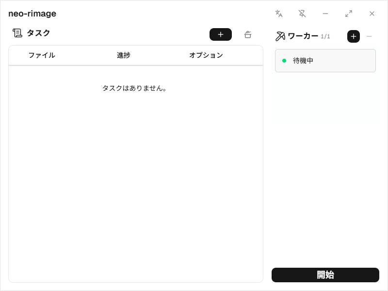
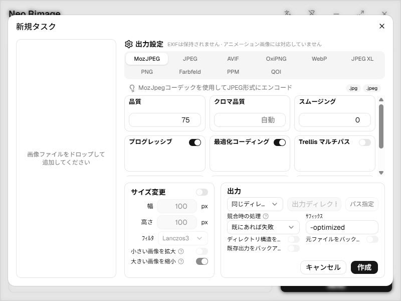

# neo-rimage

**画像の変換と最適化を、デスクトップで。すべてローカルで処理。**

[English](README.md) | [简体中文](README.zh-CN.md) | **日本語**

neo-rimage は、**Tauri、React、Rust** で構築された、画像の一括変換・圧縮・リサイズに対応するデスクトップアプリです。エンコーダーと出力設定を選び、可視化されたタスクキューで画像を処理できます。

画像処理は [rimage](https://github.com/vlad-salone/rimage) と専用のコーデックを使用し、Rust アプリのプロセス内で実行されます。画像をクラウドの変換サービスへアップロードする必要はなく、rimage の CLI を別途インストールする必要もありません。

> **プロジェクトの状況：** 現在は初期開発段階（`0.1.x`）です。検証済みのプラットフォームは Windows x64 で、macOS と Linux のビルドはまだ検証していません。以下では、ソースからの実行とビルド方法を紹介します。



[主な機能](#主な機能) · [対応形式](#対応形式) · [使い方](#使い方) · [開発とビルド](#開発とビルド) · [アーキテクチャ](#アーキテクチャ)

## 主な機能

- **一括入力：** ファイルやフォルダーをドラッグ＆ドロップで追加できます。サブフォルダーもスキャンし、タスク作成前に重複するファイルパスを除外します。
- **複数のエンコーダー：** MozJPEG、AVIF、OxiPNG、WebP、JPEG XL など、10 種類のエンコーダーを選択できます。
- **リサイズ設定：** 出力サイズとリサンプリングフィルターを指定し、拡大・縮小をそれぞれ許可するか設定できます。
- **明確な出力ルール：** 元のフォルダーまたは指定フォルダーに保存できます。ファイル名の接尾辞、フォルダー構造の保持、同名ファイルとの競合時の動作を設定でき、ファイルを置き換える際にはバックアップも有効にできます。
- **タスクとワーカーの可視化：** タスクの進捗とワーカーの状態を確認し、並列処理数を調整できます。**開始 / 一時停止**（英語 UI では **GO / STOP**）でスケジューリングを制御できます。
- **多言語 UI：** 英語、簡体字中国語、日本語を切り替えられます。ウィンドウを常に手前に表示する機能もあります。

### エンコード設定



## 対応形式

### 入力

現在のビルドでは **JPEG、PNG、WebP、JPEG XL、BMP/DIB、Radiance HDR、PSD、QOI、Farbfeld、PNM/PPM** のファイルを入力できます。実際のデコード可否は、使用するコーデックの対応範囲と制限に依存します。拡張子が受け付けられても、その形式のすべてのバリエーションをデコードできるとは限りません。

### 出力

**10 種類のエンコーダーで、8 種類の出力形式**に対応しています。

| エンコーダー | 出力拡張子 | 備考 |
| --- | --- | --- |
| MozJPEG | `.jpg`、`.jpeg` | 品質、プログレッシブ出力、高度な圧縮設定に対応 |
| JPEG | `.jpg`、`.jpeg` | ベースラインまたはプログレッシブ JPEG 出力 |
| AVIF | `.avif` | 色の品質、アルファチャンネルの品質、エンコード速度を設定可能 |
| OxiPNG | `.png` | PNG の可逆最適化 |
| WebP | `.webp` | 非可逆・可逆エンコードに対応 |
| JPEG XL | `.jxl` | 現在のビルドでは可逆エンコードのみ |
| PNG | `.png` | 標準的な PNG エンコード |
| Farbfeld | `.ff`、`.farbfeld` | 16 ビット RGBA 出力 |
| PPM | `.ppm`、`.pnm` | Portable Pixmap 出力。アルファチャンネルを含む画像は PAM ヘッダーを使用 |
| QOI | `.qoi` | Quite OK Image エンコード |

### 現在の制限

- アニメーション画像の入力には対応していません。
- EXIF メタデータは保持されず、EXIF に基づく画像の向きの自動補正も未実装です。カメラで撮影した写真は、処理前に向きを確認してください。
- 現在のビルドでは AVIF、SVG、TIFF、GIF の入力デコードは有効になっていません。AVIF は**出力形式**として利用できます。

## 使い方

1. [開発とビルド](#開発とビルド)の手順に従い、デスクトップアプリを起動します。
2. 画像ファイルまたはフォルダーをウィンドウにドロップします。**新規タスク**ダイアログが開き、スキャンされた入力一覧が表示されます。
3. エンコーダーを選び、設定を調整します。必要に応じてリサイズを有効にします。
4. 出力フォルダー、ファイル名の接尾辞、競合時の動作を設定します。初回は別の出力フォルダーを指定することをお勧めします。既定の接尾辞は `-optimized` で、出力先に同名ファイルが存在する場合は処理を失敗させる設定になっています。
5. **作成**をクリックし、**開始**（英語 UI では **GO**）でキュー内の処理を開始します。
6. ワーカーパネルの **+ / −** ボタンで並列処理数を調整し、タスク一覧で進捗を確認します。

**一時停止するのはスケジューリングであり、実行中のコーデック処理ではありません。** 開始済みの処理は完了まで続行し、未開始の処理は再び**開始**を押すまで待機します。英語 UI のボタンは **STOP / GO** です。

タイトルバーの言語メニューから UI の言語を切り替えられます。

## 開発とビルド

### 必要な環境

| 依存関係 | バージョン / 詳細 |
| --- | --- |
| Node.js | `^20.19.0 \|\| >=22.12.0`。`package.json` の宣言に準拠 |
| pnpm | `10.30.3`。`packageManager` の宣言に準拠 |
| Rust | `1.95.0` 以降。同梱の rimage ライブラリが必要とするバージョン |
| ネイティブ依存関係 | OS ごとの [Tauri 2 の前提条件](https://v2.tauri.app/start/prerequisites/)に従ってインストール |

Windows では **MSVC 版の Rust ツールチェーン**を使用してください。Microsoft C++ Build Tools の **C++ によるデスクトップ開発**ワークロード、Windows SDK、Microsoft Edge WebView2 ランタイムが必要です。x86/x64 では、MozJPEG の SIMD アセンブリを有効にするために NASM のインストールをお勧めします。MSI インストーラーを作成する場合は、Windows の VBScript オプション機能も必要です。詳しくは上記の Tauri ドキュメントを参照してください。

### ローカルで実行

リポジトリをクローンまたはダウンロードし、ルートディレクトリでターミナルを開いて次のコマンドを実行します。

```sh
pnpm install --frozen-lockfile
pnpm tauri dev
```

`pnpm tauri dev` は Vite とネイティブアプリの両方を起動します。`pnpm dev` はフロントエンドの開発サーバーのみを起動し、画像処理に必要なネイティブバックエンドは提供しません。

### アプリのビルド

デスクトップアプリと、現在のプラットフォームで設定されているインストーラーをビルドします。

```sh
pnpm tauri build
```

Windows で NSIS インストーラーのみをビルドする場合：

```sh
pnpm tauri build --bundles nsis
```

Windows x64 用の EXE/MSI インストーラーとポータブル ZIP は [Releases](https://github.com/lien030/Neo-Rimage/releases) からダウンロードできます。リリース用のインストーラーは、既定で `src-tauri/target/release/bundle/` に出力されます。リリースアプリ、NSIS、MSI のビルドは検証済みですが、インストール・アンインストールの手順は未検証です。公開前のライセンス資料の準備については[リリースビルド手順](docs/BUILDING.md)を参照してください。

### チェックとテスト

次のコマンドはすべてリポジトリのルートで実行します。

| コマンド | 目的 |
| --- | --- |
| `pnpm test` | フロントエンドのユニットテスト |
| `pnpm build` | TypeScript のチェックとフロントエンドの本番ビルド |
| `pnpm contracts:check` | フロントエンドの IPC 型と Rust のコントラクトの一致を確認 |
| `pnpm contracts:generate` | Rust のコントラクト変更後にフロントエンドの IPC 型を再生成 |
| `cargo test --locked --manifest-path src-tauri/Cargo.toml --lib` | アプリの Rust テスト |
| `cargo test --locked --manifest-path src-tauri/Cargo.toml -p rimage --lib` | 有効な機能に対応する同梱 rimage ライブラリのテスト |
| `cargo clippy --locked --manifest-path src-tauri/Cargo.toml --all-targets -- -D warnings` | Rust の静的解析 |

## アーキテクチャ

```text
React UI + Valtio
       │ Tauri IPC · Rust から生成する TypeScript コントラクト
       ▼
BackendService + RequestNormalizer
       ▼
JobManager
       ▼
LocalEngine → rimage + 専用コーデック
```

Rust バックエンドは、入力ファイルの検出、出力の検証、スケジューリング、処理の実行を担当します。`JobManager` がタスクとワーカーの状態を一元管理し、フロントエンドはコマンドを送信してバックエンドのスナップショットを同期します。フロントエンド側で別の実行キューを管理することはありません。画像エンジンはアプリのプロセス内で動作し、外部 CLI をサイドカーとして起動しません。

| パス | 役割 |
| --- | --- |
| `src/components/` | タスク一覧、ワーカーパネル、エンコード設定、共通 UI |
| `src/features/` | タスクの下書き、入力処理、バックエンドコマンド、実行状態の同期 |
| `src/lib/ipc/` | IPC クライアントと生成された TypeScript コントラクト |
| `src/i18n/` | 英語・簡体字中国語・日本語の翻訳 |
| `src-tauri/src/domain/` | Rust の設定モデル、IPC コントラクト、機能定義 |
| `src-tauri/src/backend/` | リクエストの正規化、ファイルシステムのスキャン、バックエンドサービス |
| `src-tauri/src/jobs/` | タスクのライフサイクル、スケジューリング、ワーカー、進捗スナップショット |
| `src-tauri/src/engine/` | 画像処理パイプライン、コーデック、出力ファイルの書き込み |
| `src-tauri/vendor/rimage/` | 同梱の上流ライブラリと最小限の統合パッチ |
| `tools/` | Rust から TypeScript へのコントラクト生成ツール |

フロントエンドには TypeScript、Vite、Tailwind CSS、Radix UI、Valtio、i18next を使用しています。詳細は[実装と検証の記録](docs/implementation-validation.md)を参照してください。同梱 rimage のソースを変更する前に、[上流ライブラリの統合メモ](src-tauri/vendor/rimage/NEO_RIMAGE_PATCHES.md)を確認してください。

## コントリビューション

不具合報告、コーデックの境界ケース、ドキュメントの改善、翻訳を歓迎します。問題を報告する際は、OS、アプリのバージョンまたはコミット、入力形式、エンコーダーの設定、再現手順を記載してください。サンプル画像は、公開しても問題ないものだけを共有してください。

変更範囲を絞り、関連するチェックを実行してください。Rust のドメイン型を変更する際は IPC コントラクトも再生成してください。翻訳ファイルは `src/i18n/` にあります。

## 謝辞

- [rimage](https://github.com/vlad-salone/rimage)：画像処理の主要な操作とコーデック統合を提供しています。
- [zune-image](https://github.com/etemesi254/zune-image)：画像のデコードと追加のコーデックを提供しています。
- [Tauri](https://tauri.app/) と [React](https://react.dev/)：デスクトップランタイムとフロントエンドの基盤です。

README の構成と見せ方は、[Caesium Image Compressor](https://github.com/Lymphatus/caesium-image-compressor) と [Squoosh](https://github.com/GoogleChromeLabs/squoosh) も参考にしています。

## ライセンス

neo-rimage のオリジナルソースは **MIT ライセンス**で提供されています。全文は [LICENSE](LICENSE) を参照してください。結合されたアプリケーションのバイナリには GPL ライセンスの imagequant が含まれるため、**GPL-3.0-or-later** で配布します。[配布条件](docs/DISTRIBUTION.md)、[固定バージョンのソース一覧](docs/SOURCES.md)、[リリースビルド手順](docs/BUILDING.md)を参照してください。インストーラーとポータブル版にはライセンス資料が同梱されます。

同梱 rimage ライブラリは **MIT OR Apache-2.0** でライセンスされています。[MIT ライセンス](src-tauri/vendor/rimage/LICENSE-MIT)と [Apache-2.0 ライセンス](src-tauri/vendor/rimage/LICENSE-APACHE)を参照してください。その他の依存関係には、それぞれのライセンスが適用されます。
