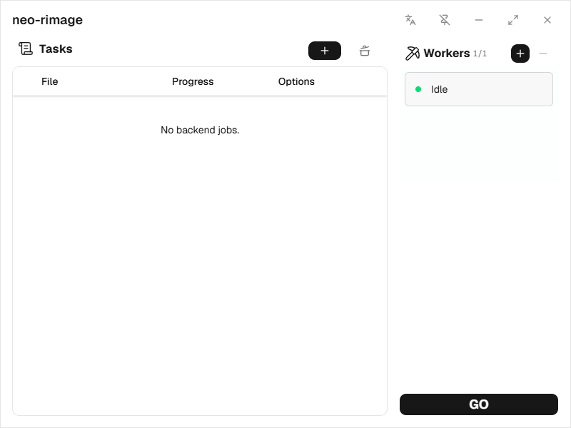
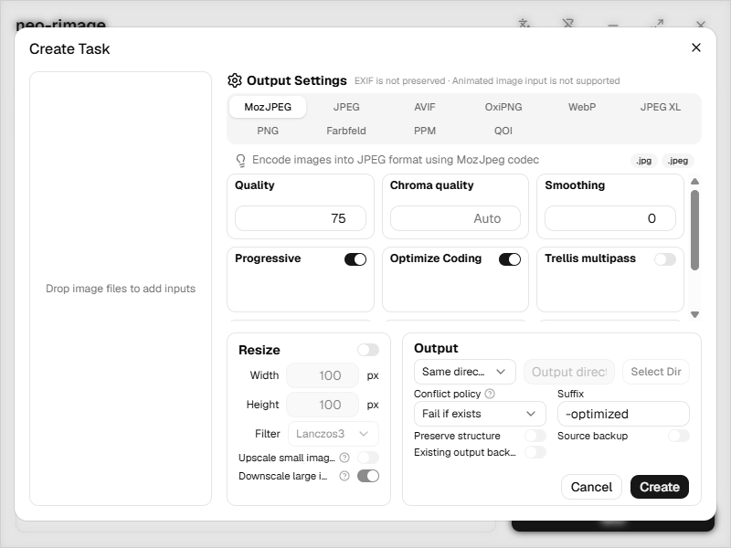

# neo-rimage

**Local image conversion and optimization, with a desktop interface.**

**English** | [简体中文](README.zh-CN.md) | [日本語](README.ja.md)

neo-rimage is a desktop app for batch image conversion, compression, and resizing, built with **Tauri, React, and Rust**. Choose an encoder, configure the output, and process your images through a visible task queue.

Image processing runs locally inside the Rust application using [rimage](https://github.com/vlad-salone/rimage) and dedicated codecs. Your images do not need to be uploaded to a cloud conversion service, and a separate rimage CLI installation is not required.

> **Project status:** Early development (`0.1.x`). Windows x64 is the currently validated platform; macOS and Linux builds have not yet been validated. The instructions below cover running and building from source.



[Features](#features) · [Formats](#supported-formats) · [Usage](#usage) · [Development](#development) · [Architecture](#architecture)

## Features

- **Batch input:** Drag in files or folders. Folder scanning includes subdirectories, and duplicate file paths are removed before creating tasks.
- **Multiple encoders:** Choose from 10 encoder options, including MozJPEG, AVIF, OxiPNG, WebP, and JPEG XL.
- **Resize controls:** Set target dimensions, choose a resampling filter, and decide whether upscaling and downscaling are allowed.
- **Explicit output rules:** Use the source directory or a custom destination, add a filename suffix, preserve directory structure, and choose how to handle filename collisions. Backup options are available when replacing files.
- **Memory-aware parallelism:** One JobManager owns preparation, worker allocation and a shared memory budget. Memory-waiting items remain queued without occupying workers; smaller images can proceed, with an eight-bypass starvation barrier. Estimates are not an OS-enforced memory limit.
- **Visible queue and workers:** Follow task progress and worker status, adjust concurrency, and start or pause scheduling with **GO / STOP**.
- **Multilingual interface:** Switch between English, Simplified Chinese, and Japanese. The window also supports an always-on-top mode.

### Encoding settings



## Supported formats

### Input

Version **0.2.0** accepts **JPEG, PNG, WebP, JPEG XL, BMP/DIB, Radiance HDR, PSD, QOI, Farbfeld, PNM/PPM, AVIF, TIFF, SVG and SVGZ** files. Decoding is subject to the capabilities and limits of the underlying codecs; accepting a file extension does not guarantee that every variant of that format can be decoded.

### Output

There are **10 encoder options across 8 output formats**:

| Encoder | Output | Notes |
| --- | --- | --- |
| MozJPEG | `.jpg`, `.jpeg` | JPEG encoding with quality, progressive, and advanced compression controls |
| JPEG | `.jpg`, `.jpeg` | Baseline or progressive JPEG encoding |
| AVIF | `.avif` | Color quality, alpha quality, and encoding speed controls |
| OxiPNG | `.png` | Lossless PNG optimization |
| WebP | `.webp` | Lossy or lossless encoding |
| JPEG XL | `.jxl` | Lossless encoding only in the current build |
| PNG | `.png` | Standard PNG encoding |
| Farbfeld | `.ff`, `.farbfeld` | 16-bit RGBA output |
| PPM | `.ppm`, `.pnm` | Portable pixmap output; images with alpha use a PAM header |
| QOI | `.qoi` | Quite OK Image encoding |

### Current limitations

- Animated image input is not supported.
- EXIF metadata is not preserved, and EXIF-based automatic orientation is not implemented. Check the orientation of camera photos before processing.
- AVIF input supports static SDR only; animations, grids and PQ/HLG HDR are rejected. 10/12-bit input is converted to RGBA8 with a warning; AVIF ICC fidelity is limited.
- TIFF supports common Deflate/Fax/JPEG/LZW variants, not every TIFF variant. Multi-page files are rejected; Float32 samples are accounted at their actual size.
- SVG/SVGZ uses cached system fonts and vector-resolution leading resize. Resources must be embedded or inside the source directory tree; network/script access is forbidden. Expanded documents/resources are limited to 64 MiB and nesting to 8 levels. GIF input is not supported.

## Usage

1. Launch the desktop app using the [development instructions](#development).
2. Drag image files or a folder onto the window. The **Create Task** dialog opens with the discovered inputs.
3. Select an encoder and adjust its settings. Enable resizing if needed.
4. Choose an output directory, suffix, and collision policy. A separate destination is recommended for your first run; the default suffix is `-optimized`, and the default collision policy is to fail if a file already exists.
5. Click **Create**, then **GO** to start processing queued work.
6. Use the worker panel's **+ / −** buttons to adjust concurrency and watch progress in the task table.

**STOP pauses scheduling, not an active codec operation.** Work already running is allowed to finish; queued work waits until you press **GO** again.

Use the language menu in the title bar to change the interface language.

## Development

### Prerequisites

| Requirement | Version / details |
| --- | --- |
| Node.js | `^20.19.0 \|\| >=22.12.0`, as declared in `package.json` |
| pnpm | `10.30.3`, as declared in `packageManager` |
| Rust | `1.95.0` or newer, required by the vendored rimage library |
| Native dependencies | Follow the [Tauri 2 prerequisites](https://v2.tauri.app/start/prerequisites/) for your operating system |

On Windows, use the **MSVC Rust toolchain** and install Microsoft C++ Build Tools with the **Desktop development with C++** workload, a Windows SDK, and the Microsoft Edge WebView2 runtime. NASM is recommended on x86/x64 for MozJPEG's SIMD assembly support. Building MSI installers also requires the Windows VBScript optional feature; see the Tauri prerequisites above.

Windows native decoding uses pinned **dav1d 1.5.4**, statically linked with the dynamic MSVC CRT. No dav1d DLL or vcpkg installation is needed at runtime. The helper below bootstraps a pinned vcpkg checkout and leaves caches under `src-tauri/target/native`; environment settings affect only the current process.

### Run locally

Clone or download this repository, open a terminal in its root directory, and run:

```powershell
pnpm install --frozen-lockfile
pnpm tauri dev
```

`pnpm tauri dev` starts both Vite and the native application. On Windows, `pnpm tauri dev` and `pnpm tauri build` automatically prepare the pinned native dependencies and pass their environment to Tauri; cached dependencies are reused without changing global PATH. `pnpm dev` starts only the frontend development server; it does not provide the native backend required for image processing.

### Build

Build the desktop application and the platform's configured installer bundles:

```powershell
pnpm tauri build
```

To build only an NSIS installer on Windows:

```powershell
pnpm tauri build --bundles nsis
```

Windows x64 EXE/MSI installers and a portable ZIP are available from [Releases](https://github.com/lien030/Neo-Rimage/releases). Release bundles are written to `src-tauri/target/release/bundle/` by default. Release application, NSIS, and MSI builds are validated; installation/uninstallation has not been tested. See [release build instructions](docs/BUILDING.md), including license resource preparation before publishing.

### Checks

Run these commands from the repository root:

| Command | Purpose |
| --- | --- |
| `pnpm test` | Frontend unit tests |
| `pnpm build` | TypeScript checking and frontend production build |
| `pnpm contracts:check` | Check that frontend IPC types match the Rust contracts |
| `pnpm contracts:generate` | Regenerate frontend IPC types after a Rust contract change |
| `cargo test --locked --manifest-path src-tauri/Cargo.toml --lib` | Application Rust tests |
| `cargo test --locked --manifest-path src-tauri/Cargo.toml -p rimage --lib` | Vendored rimage library tests for enabled features |
| `cargo clippy --locked --manifest-path src-tauri/Cargo.toml --all-targets -- -D warnings` | Rust lint checks |

## Architecture

```text
React UI + Valtio
       │ Tauri IPC · Rust-generated TypeScript contracts
       ▼
BackendService + RequestNormalizer
       ▼
JobManager
       ▼
LocalEngine → rimage + dedicated codecs
```

The Rust backend owns input discovery, output validation, scheduling, and execution. `JobManager` is the authority for task and worker state; the frontend sends commands and synchronizes backend snapshots instead of maintaining a separate execution queue. The image engine runs in-process, without spawning a CLI sidecar.

| Path | Responsibility |
| --- | --- |
| `src/components/` | Task table, worker panel, encoding controls, and shared UI |
| `src/features/` | Task drafts, input handling, backend commands, and runtime synchronization |
| `src/lib/ipc/` | IPC client and generated TypeScript contracts |
| `src/i18n/` | English, Simplified Chinese, and Japanese translations |
| `src-tauri/src/domain/` | Rust configuration models, IPC contracts, and capability definitions |
| `src-tauri/src/backend/` | Request normalization, filesystem discovery, and backend service |
| `src-tauri/src/jobs/` | Task lifecycle, scheduling, workers, and progress snapshots |
| `src-tauri/src/engine/` | Image pipeline, codecs, and output writing |
| `src-tauri/vendor/rimage/` | Vendored upstream library and its minimal integration patch |
| `tools/` | Rust-to-TypeScript contract generation |

The frontend uses TypeScript, Vite, Tailwind CSS, Radix UI, Valtio, and i18next. See the [implementation and validation notes](docs/implementation-validation.md) for more detail, and the [vendor notes](src-tauri/vendor/rimage/NEO_RIMAGE_PATCHES.md) before changing the bundled rimage source.

## Contributing

Bug reports, codec edge cases, documentation improvements, and translations are welcome. When reporting an issue, include your operating system, app version or commit, input format, encoder settings, and steps to reproduce. Share sample images only if you are comfortable making them public.

Keep changes focused, run the relevant checks, and regenerate the IPC contracts when changing Rust domain types. Translation files live in `src/i18n/`.

## Acknowledgments

- [rimage](https://github.com/vlad-salone/rimage) provides the core image operations and codec integrations.
- [zune-image](https://github.com/etemesi254/zune-image) provides image decoding and additional codecs.
- [Tauri](https://tauri.app/) and [React](https://react.dev/) provide the desktop runtime and frontend foundation.

README organization and presentation also take cues from [Caesium Image Compressor](https://github.com/Lymphatus/caesium-image-compressor) and [Squoosh](https://github.com/GoogleChromeLabs/squoosh).

## License

Original neo-rimage source is licensed under the **MIT License**. See [LICENSE](LICENSE) for the full text. The combined application binaries include GPL-licensed imagequant and are distributed under **GPL-3.0-or-later**; see the [distribution terms](docs/DISTRIBUTION.md), [fixed-version source references](docs/SOURCES.md), and [release build instructions](docs/BUILDING.md). Installers and portable packages include the accompanying license materials.

The vendored rimage library is licensed under **MIT OR Apache-2.0**; see its [MIT license](src-tauri/vendor/rimage/LICENSE-MIT) and [Apache-2.0 license](src-tauri/vendor/rimage/LICENSE-APACHE). Other dependencies retain their respective licenses.
