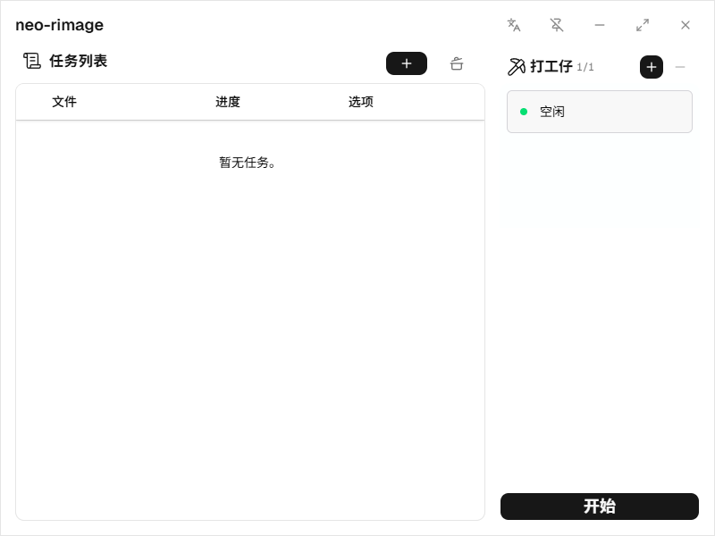
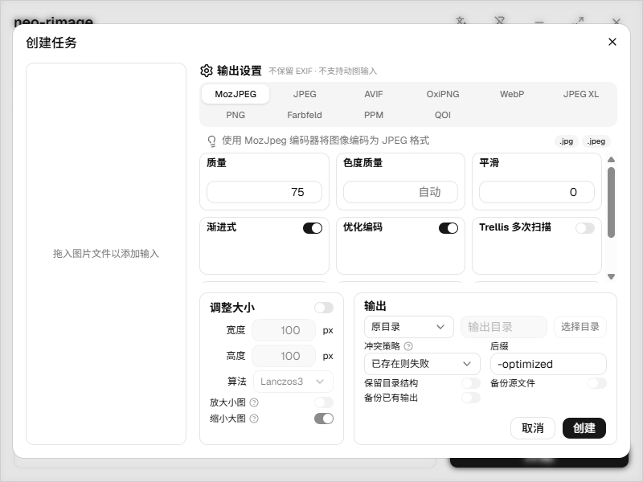

# neo-rimage

**在桌面上完成图片转换与优化，全程本地处理。**

[English](README.md) | **简体中文** | [日本語](README.ja.md)

neo-rimage 是一款基于 **Tauri、React 与 Rust** 的桌面图片处理工具，支持批量格式转换、压缩与尺寸调整。选择编码器、配置输出规则，再通过可视化任务队列处理图片。

图像处理在 Rust 应用进程内完成，使用 [rimage](https://github.com/vlad-salone/rimage) 与专用编解码器。图片无需上传到云端转换服务，也不需要额外安装 rimage 命令行工具。

> **项目状态：** 当前处于早期开发阶段（`0.1.x`）。已验证的平台为 Windows x64；macOS 与 Linux 构建尚未验证。下文介绍从源码运行与构建的方式。



[功能特点](#功能特点) · [支持格式](#支持格式) · [使用方式](#使用方式) · [开发与构建](#开发与构建) · [项目架构](#项目架构)

## 功能特点

- **批量导入：** 拖入文件或文件夹，自动扫描子目录，并在创建任务前对重复文件路径去重。
- **多种编码器：** 提供 10 个编码器选项，包括 MozJPEG、AVIF、OxiPNG、WebP 和 JPEG XL。
- **尺寸调整：** 设置目标尺寸、选择重采样滤镜，并分别控制是否允许放大和缩小图片。
- **明确的输出规则：** 保存到原目录或指定目录，设置文件名后缀、保留目录结构，并选择同名文件冲突策略。替换文件时可启用备份选项。
- **可视化队列与工作线程：** 查看任务进度和工作线程状态、调整并发数量，通过**开始 / 暂停**（英文界面为 **GO / STOP**）启动或暂停调度。
- **多语言界面：** 支持英语、简体中文与日语切换，并提供窗口置顶功能。

### 编码设置



## 支持格式

### 输入

当前构建接受 **JPEG、PNG、WebP、JPEG XL、BMP/DIB、Radiance HDR、PSD、QOI、Farbfeld 和 PNM/PPM** 文件。实际解码能力受底层编解码器支持范围与限制影响；扩展名被接受，并不代表该格式的所有变体都能成功解码。

### 输出

共有 **10 个编码器选项，覆盖 8 种输出格式**：

| 编码器 | 输出扩展名 | 说明 |
| --- | --- | --- |
| MozJPEG | `.jpg`、`.jpeg` | 支持质量、渐进式编码及更多高级压缩参数 |
| JPEG | `.jpg`、`.jpeg` | 基线式或渐进式 JPEG 编码 |
| AVIF | `.avif` | 可配置颜色质量、透明通道质量与编码速度 |
| OxiPNG | `.png` | PNG 无损优化 |
| WebP | `.webp` | 有损或无损编码 |
| JPEG XL | `.jxl` | 当前构建仅支持无损编码 |
| PNG | `.png` | 标准 PNG 编码 |
| Farbfeld | `.ff`、`.farbfeld` | 16 位 RGBA 输出 |
| PPM | `.ppm`、`.pnm` | Portable Pixmap 输出；带透明通道的图片使用 PAM 文件头 |
| QOI | `.qoi` | Quite OK Image 编码 |

### 当前限制

- 不支持动画图片输入。
- 不保留 EXIF 元数据，也尚未实现基于 EXIF 的自动方向校正。处理相机照片前，请先确认图片方向。
- 当前构建未启用 AVIF、SVG、TIFF 和 GIF 输入解码。AVIF 可作为**输出格式**使用。

## 使用方式

1. 按照[开发与构建](#开发与构建)中的说明启动桌面应用。
2. 将图片文件或文件夹拖入窗口，**创建任务**对话框会显示扫描得到的输入列表。
3. 选择编码器并调整参数，需要时启用尺寸调整。
4. 设置输出目录、文件名后缀和冲突策略。首次使用建议选择独立输出目录；默认后缀为 `-optimized`，默认冲突策略为目标文件已存在时失败。
5. 点击**创建**，再点击**开始**（英文界面为 **GO**）处理队列中的任务。
6. 使用工作线程面板中的 **+ / −** 按钮调整并发数量，在任务表格中查看进度。

**暂停的是调度，而不是正在执行的编解码操作。** 已开始的处理会继续完成，尚未开始的项目等待再次点击**开始**后执行；英文界面的按钮分别为 **STOP / GO**。

可通过标题栏中的语言菜单切换界面语言。

## 开发与构建

### 环境要求

| 依赖 | 版本 / 说明 |
| --- | --- |
| Node.js | `^20.19.0 \|\| >=22.12.0`，与 `package.json` 的声明一致 |
| pnpm | `10.30.3`，与 `packageManager` 的声明一致 |
| Rust | `1.95.0` 或更新版本，由内置的 rimage 库要求 |
| 原生依赖 | 按操作系统安装 [Tauri 2 所需依赖](https://v2.tauri.app/start/prerequisites/) |

Windows 下请使用 **MSVC Rust 工具链**，安装 Microsoft C++ Build Tools，并勾选**使用 C++ 的桌面开发**工作负载，同时准备 Windows SDK 与 Microsoft Edge WebView2 运行时。x86/x64 平台建议安装 NASM，以启用 MozJPEG 的 SIMD 汇编支持。构建 MSI 安装包还需要启用 Windows 的 VBScript 可选功能，详见上方 Tauri 文档。

### 本地运行

克隆或下载本仓库，在项目根目录打开终端后执行：

```sh
pnpm install --frozen-lockfile
pnpm tauri dev
```

`pnpm tauri dev` 会同时启动 Vite 与原生应用。`pnpm dev` 只启动前端开发服务器，不会提供图片处理所需的原生后端。

### 构建应用

构建桌面应用及当前平台配置的安装包：

```sh
pnpm tauri build
```

Windows 下若只需要 NSIS 安装包：

```sh
pnpm tauri build --bundles nsis
```

Release 安装包默认输出到 `src-tauri/target/release/bundle/`。需要 debug NSIS 安装包时，使用 `pnpm tauri build --debug --bundles nsis`。目前原生打包验证覆盖 Windows x64 debug 应用与 NSIS 安装包，尚未覆盖 release 打包及安装、卸载流程。

### 检查与测试

以下命令均在项目根目录执行：

| 命令 | 用途 |
| --- | --- |
| `pnpm test` | 前端单元测试 |
| `pnpm build` | TypeScript 检查与前端生产构建 |
| `pnpm contracts:check` | 检查前端 IPC 类型与 Rust 合约是否一致 |
| `pnpm contracts:generate` | 修改 Rust 合约后重新生成前端 IPC 类型 |
| `cargo test --locked --manifest-path src-tauri/Cargo.toml --lib` | 应用 Rust 测试 |
| `cargo test --locked --manifest-path src-tauri/Cargo.toml -p rimage --lib` | 已启用功能对应的内置 rimage 库测试 |
| `cargo clippy --locked --manifest-path src-tauri/Cargo.toml --all-targets -- -D warnings` | Rust 静态检查 |

## 项目架构

```text
React 界面 + Valtio
       │ Tauri IPC · 由 Rust 生成的 TypeScript 合约
       ▼
BackendService + RequestNormalizer
       ▼
JobManager
       ▼
LocalEngine → rimage + 专用编解码器
```

Rust 后端负责输入发现、输出校验、任务调度与执行。`JobManager` 是任务和工作线程状态的唯一权威；前端发送命令并同步后端快照，不维护第二套执行队列。图像引擎在应用进程内运行，不启动外部 CLI sidecar。

| 路径 | 职责 |
| --- | --- |
| `src/components/` | 任务表格、工作线程面板、编码设置与通用界面组件 |
| `src/features/` | 任务草稿、输入处理、后端命令与运行状态同步 |
| `src/lib/ipc/` | IPC 客户端与自动生成的 TypeScript 合约 |
| `src/i18n/` | 英语、简体中文与日语翻译 |
| `src-tauri/src/domain/` | Rust 配置模型、IPC 合约与能力定义 |
| `src-tauri/src/backend/` | 请求规范化、文件系统扫描与后端服务 |
| `src-tauri/src/jobs/` | 任务生命周期、调度、工作线程与进度快照 |
| `src-tauri/src/engine/` | 图像流水线、编解码器与输出写入 |
| `src-tauri/vendor/rimage/` | 内置上游库及最小集成补丁 |
| `tools/` | Rust 到 TypeScript 的合约生成工具 |

前端采用 TypeScript、Vite、Tailwind CSS、Radix UI、Valtio 与 i18next。更多实现信息见[实施与验证记录](docs/implementation-validation.md)；修改内置 rimage 源码前，请先阅读[上游集成说明](src-tauri/vendor/rimage/NEO_RIMAGE_PATCHES.md)。

## 参与贡献

欢迎提交问题反馈、编解码边界案例、文档改进与翻译。反馈问题时，请附上操作系统、应用版本或 commit、输入格式、编码参数与复现步骤。仅在愿意公开图片的情况下提供样本。

请保持修改范围明确，运行相关检查，并在调整 Rust domain 类型后重新生成 IPC 合约。翻译文件位于 `src/i18n/`。

## 致谢

- [rimage](https://github.com/vlad-salone/rimage)：提供核心图像操作与编解码器集成。
- [zune-image](https://github.com/etemesi254/zune-image)：提供图像解码与其他编解码器。
- [Tauri](https://tauri.app/) 与 [React](https://react.dev/)：提供桌面运行时与前端基础。

README 的组织与展示方式也参考了 [Caesium Image Compressor](https://github.com/Lymphatus/caesium-image-compressor) 和 [Squoosh](https://github.com/GoogleChromeLabs/squoosh)。

## 许可证

neo-rimage 采用 **MIT 许可证**，完整条款见 [LICENSE](LICENSE)。

内置 rimage 库采用 **MIT OR Apache-2.0** 双许可证，详见其 [MIT 许可证](src-tauri/vendor/rimage/LICENSE-MIT)与 [Apache-2.0 许可证](src-tauri/vendor/rimage/LICENSE-APACHE)。其他依赖保留各自的许可证。
