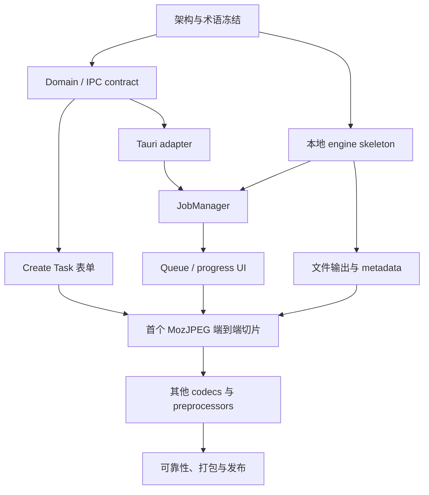

# neo-rimage 实装计划索引

> [!abstract] 文档目的
> 这套资料用于把 neo-rimage 从 UI/队列原型推进为直接静态调用 `rimage` Rust library 的完整 GUI。文档按“架构决策 → 前端/后端模块 → 跨端契约 → Agent 工作包”组织，可直接作为子 Agent 的任务输入。

## 已锁定的核心决策

1. neo-rimage **不会调用 rimage CLI exe**，不使用 sidecar、shell 参数拼接或 CLI 输出解析。
2. `rimage` 作为 Rust library 静态链接到 Tauri 应用。
3. 高层 orchestration engine 由 neo-rimage 在 `src-tauri` 内自行维护，底层复用 rimage codecs/operations。
4. engine 不依赖 Tauri；Tauri commands/events 只是 adapter。
5. 后端 JobManager 是 queue、task、progress、cancellation 的唯一权威状态源。
6. 前端 Create Task 表单状态与运行队列状态严格分离。
7. IPC 使用稳定、可验证的字符串 tagged contract，不使用按序号对应的前后端枚举。
8. 并发采用统一预算，不保留“一次点击增加一个永久 OS 线程”的最终设计。

## 推荐阅读顺序

### 1. 先理解全局

- [[docs/rimage-core-integration-review|现状与参数评审]]
- [[docs/implementation/01-overview/00-program-overview|项目总览]]
- [[docs/implementation/01-overview/01-target-architecture|目标架构]]
- [[docs/implementation/01-overview/02-delivery-roadmap|交付路线图]]
- [[docs/implementation/01-overview/03-glossary-and-conventions|术语与协作约定]]

### 2. 前端工作流

- [[docs/implementation/02-frontend/00-frontend-overview|前端总览]]
- [[docs/implementation/02-frontend/01-create-task-form|Create Task 表单]]
- [[docs/implementation/02-frontend/02-task-queue-and-workers|任务队列与 Worker 视图]]
- [[docs/implementation/02-frontend/03-native-shell-settings-i18n|原生 Shell、设置与多语言]]
- [[docs/implementation/02-frontend/04-frontend-quality-plan|前端质量计划]]

### 3. 后端工作流

- [[docs/implementation/03-backend/00-backend-overview|后端总览]]
- [[docs/implementation/03-backend/01-local-engine-module|本地 Engine 模块]]
- [[docs/implementation/03-backend/02-job-manager-concurrency|JobManager 与并发]]
- [[docs/implementation/03-backend/03-tauri-command-event-adapter|Tauri Command/Event Adapter]]
- [[docs/implementation/03-backend/04-filesystem-output-metadata|文件系统、输出与 Metadata]]
- [[docs/implementation/03-backend/05-backend-quality-plan|后端质量计划]]

### 4. 跨端集成与交付

- [[docs/implementation/04-integration/00-integration-overview|集成总览]]
- [[docs/implementation/04-integration/01-domain-ipc-contracts|Domain 与 IPC 契约]]
- [[docs/implementation/04-integration/02-progress-error-cancellation|进度、错误与取消]]
- [[docs/implementation/04-integration/03-e2e-test-release|端到端测试与发布]]

### 5. 分配给子 Agent

- [[docs/implementation/05-execution/00-agent-work-packages|Agent 工作包]]
- [[docs/implementation/05-execution/01-definition-of-done|Definition of Done]]
- [[docs/implementation/05-execution/02-risk-register|风险登记册]]

## 工作流依赖图

## 文档使用方式

- 每个模块文档描述目标、边界、依赖、交付物、阶段任务、验收和避坑点。
- 实现 Agent 只能在工作包声明的路径范围内修改文件。
- 如果需求与本索引中的核心决策冲突，应暂停实现并回到架构评审，而不是自行选择替代方案。
- 模块完成不等于可合并；必须同时满足对应工作包和 [[docs/implementation/05-execution/01-definition-of-done|Definition of Done]]。

## 当前文档状态

| 区域 | 状态 | 说明 |
| --- | --- | --- |
| 现状评审 | Complete | 已核对 neo-rimage 与 rimage v0.12.4 源码 |
| 总架构 | Active | 架构决策已冻结，允许细化但不允许隐式改变方向 |
| 前端计划 | Draft | 按模块交付，可与后端基础建设部分并行 |
| 后端计划 | Draft | engine/JobManager 是关键路径 |
| 跨端契约 | Draft | 必须在前后端大规模实现前冻结 v1 |
| Agent 工作包 | Draft | 用于后续并行执行与验收 |

