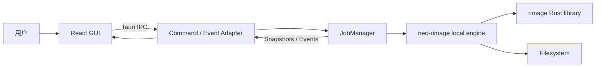
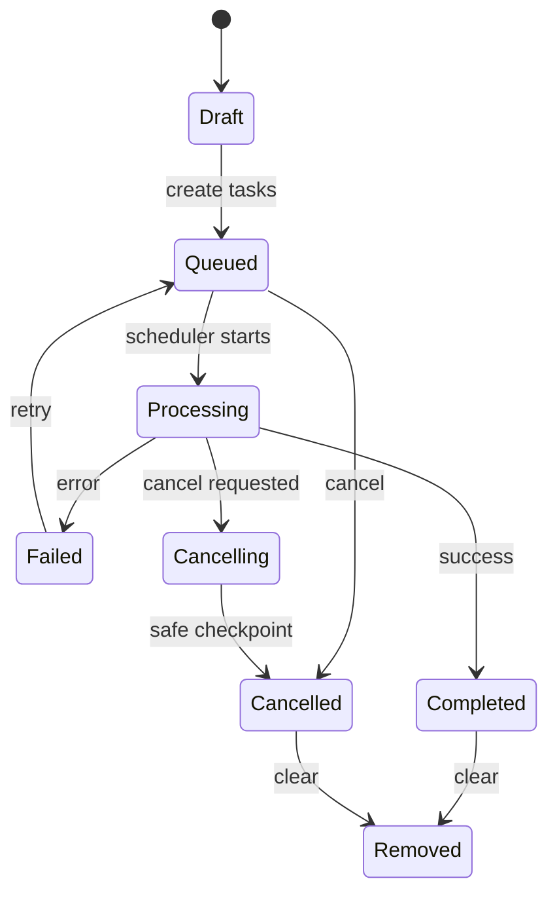

# neo-rimage 目标架构

## 1. 系统上下文



核心调用发生在同一 Tauri 进程：

```text
React → Tauri invoke → JobManager → local engine → rimage library
```

不存在 rimage exe、sidecar 或 CLI 参数层。

## 2. 分层职责

### React UI

负责：

- 表单编辑和用户校验提示；
- queue/task snapshot 展示；
- 用户操作意图；
- 原生拖放、设置、多语言和可访问性。

不负责：

- 判断 task 的真实运行状态；
- 执行文件扫描和图片处理；
- 决定最终输出路径；
- 管理 OS 线程。

### Tauri Adapter

负责：

- 接收和验证 IPC 请求的基本形状；
- 将 DTO 转换为后端 domain request；
- 调用 JobManager；
- 将 snapshots/events 转换为稳定 IPC payload；
- 维护前端可访问的权限边界。

不负责：

- codec 参数默认值业务规则；
- 任务调度策略；
- 图片处理 pipeline。

### JobManager

负责：

- queue 与 task 生命周期；
- 后端唯一状态源；
- 并发预算、执行调度和取消令牌；
- 接收 engine progress/result/error；
- 生成 snapshots 和事件；
- 应用退出前的任务处理策略。

### Local Engine

负责：

- 输入识别和 decode；
- 有序 operations；
- encoder config 映射；
- EXIF/ICC/AutoOrient 与颜色/深度准备；
- 输出路径、backup、metadata 和文件写入；
- 结构化结果、错误和阶段进度。

Engine 位于 neo-rimage 仓库，但保持 Tauri-independent。

### rimage Library

负责：

- codecs；
- resize、quantization、ICC 等低层 operations；
- 与 zune-image 生态的底层编码/解码能力。

neo-rimage 不复制这些实现。

## 3. 建议模块边界

```text
src-tauri/src/
├── commands/       IPC adapter
├── domain/         JobSpec、config、snapshot、error 语义
├── engine/         高层 orchestration
├── jobs/           queue、scheduler、cancellation、state
├── events/         event names 与 payload adapter
├── platform/       文件系统/窗口/系统集成
└── lib.rs           composition root
```

前端建议边界：

```text
src/
├── app/            shell、providers、startup sync
├── features/
│   ├── create-task/
│   ├── queue/
│   ├── native-shell/
│   └── settings/
├── ipc/            commands、events、DTO
├── domain/         前端只读 domain types
├── stores/         queue snapshot 与 UI preferences
└── components/ui/  shadcn 基础组件
```

## 4. 状态所有权

| 状态 | Owner | 前端是否可直接修改 |
| --- | --- | --- |
| Create Task 草稿 | Frontend form | 可以 |
| Dialog 打开/关闭 | Frontend UI | 可以 |
| Queue 运行状态 | JobManager | 不可以 |
| Task status/progress | JobManager | 不可以 |
| Cancellation state | JobManager | 只能发出意图 |
| Concurrency 当前值 | JobManager，设置页发起修改 | 不直接伪造 |
| Worker slot 展示 | JobManager snapshot 的派生视图 | 不可以 |
| 语言/主题偏好 | Frontend settings | 可以，必要时持久化 |

## 5. 任务生命周期



状态转换只能发生在后端。前端事件乱序时，以最新 snapshot/version 为准。

## 6. 数据边界

必须区分：

- Form Values：允许暂时不完整；
- CreateTasksRequest：已验证、可跨 IPC；
- Engine JobSpec：Rust 内部强类型；
- TaskSnapshot：只读运行状态；
- ProgressEvent：高频增量信息；
- JobResult：稳定结果与统计。

禁止直接把 Valtio proxy、React form object 或 rimage 第三方 option struct 暴露为 IPC contract。

## 7. 并发模型

采用统一预算：

- 外层并发控制同时处理多少张图片；
- engine/codec 内部并行必须计入资源预算；
- 不使用 `rayon::build_global()`；
- 不允许用户通过无限增加 worker 创建永久线程；
- concurrency 改变只影响后续调度，不破坏正在处理的任务；
- 大图场景优先保护内存，而不是追求 CPU 满载。

## 8. 失败隔离

- 单文件 decode/encode/write 失败只使该 task 失败。
- 目录无权限、路径不存在、输出冲突必须是可展示错误，不得 panic。
- codec panic 应尽可能被边界捕获并转换为 EngineError；无法安全恢复的错误需要终止当前 task，而不是静默继续。
- backup 与输出写入需要明确原子性和回滚策略。
- event 发送失败不能改变 task 的真实完成状态。

## 9. 扩展原则

新增 codec 时只扩展：

1. Domain encoder config；
2. Engine encoder adapter；
3. Create Task codec panel；
4. Contract/fixture tests。

不应修改 queue 调度、Tauri 生命周期或其他 codec 的实现。

## 10. 关联资料

- [[docs/implementation/03-backend/01-local-engine-module|本地 Engine 模块]]
- [[docs/implementation/03-backend/02-job-manager-concurrency|JobManager 与并发]]
- [[docs/implementation/04-integration/01-domain-ipc-contracts|Domain 与 IPC 契约]]
- [[docs/implementation/04-integration/02-progress-error-cancellation|进度、错误与取消]]

