# neo-rimage 分阶段交付路线图

## 1. 路线原则

- 先冻结 contract 和状态语义，再并行开发前后端。
- 先交付 MozJPEG 单一纵向切片，再扩展全部 codecs。
- 每个阶段必须有可运行、可验证的出口，不积累“大合并”。
- 原型 worker/task 逻辑只在替代方案通过后删除，避免无基线重写。
- 高风险能力（输出覆盖、backup、取消、并发）必须有专项 gate。

## 2. 阶段总览

```mermaid
gantt
    title neo-rimage 实装阶段
    dateFormat  X
    axisFormat %s
    section Foundation
    契约与术语冻结          :a1, 0, 2
    Engine skeleton          :a2, after a1, 3
    section Vertical Slice
    JobManager 基础          :b1, after a1, 3
    Create Task 基础         :b2, after a1, 3
    MozJPEG E2E              :b3, after a2, 3
    section Expansion
    Output/metadata          :c1, after b3, 2
    其他 codecs/preprocessors:c2, after b3, 4
    section Reliability
    取消/恢复/压力测试       :d1, after c1, 3
    发布与升级流程           :d2, after c2, 2
```

## 3. Phase 0：基线与契约冻结

### 目标

建立所有 Agent 共同遵守的 domain、IPC、状态、错误与版本语义。

### 工作内容

- 冻结 v1 CreateTasksRequest、EncoderConfig、PreprocessOperation、TaskSnapshot。
- 定义 task/queue 生命周期和事件名。
- 定义 output conflict、backup、metadata 和 cancellation 的产品语义。
- 固定 rimage 来源版本和 feature matrix。
- 建立 fixtures 与当前 CLI 输出基线。

### Exit Gate

- 前后端文档对同一字段不存在不同解释。
- 所有 P0 未决策项有明确 owner 和截止 gate。
- 子 Agent 可以在不自行设计协议的情况下开始工作。

## 4. Phase 1：Engine 与 JobManager 基础

### 后端主线

- 建立 Tauri-independent local engine 边界。
- 迁移 decode/encoder adapter 与最小文件输出路径。
- 建立结构化 EngineError、ProgressReporter、CancellationToken 语义。
- 建立 JobManager queue、snapshot 和有界执行器。

### 前端并行线

- 重组 IPC client/domain/store 边界。
- 建立 Create Task 稳定 form state 和基本布局。
- 先不要求所有参数可用，但不允许显示无效控件。

### Exit Gate

- Engine 能以测试输入产生可验证输出。
- JobManager 能运行假任务并产生可靠状态转换。
- 前端能提交契约合法的最小 request。

## 5. Phase 2：MozJPEG 首个纵向切片

### 范围

- 输入文件选择/拖放；
- MozJPEG 核心参数；
- 可选 resize 固定尺寸；
- 输出目录与 suffix；
- Create → Queued → Processing → Completed/Failed；
- UI 进度、错误和结果；
- 单任务取消的安全 checkpoint。

### 暂不包含

- 所有 codec 高级参数；
- 复杂 operation 重排；
- 队列持久化恢复；
- backup 和 metadata 报告可延后到 Phase 3。

### Exit Gate

- 使用同一 fixture，GUI engine 与 rimage CLI 的关键结果可解释且参数生效。
- 前端不再通过本地 push 模拟真实 task/worker。
- 任务失败不会导致应用退出。

## 6. Phase 3：Output、Metadata 与 Preprocessors

### 工作内容

- directory、preserve structure、suffix、backup；
- strip metadata、metadata report；
- resize 全模式和完整 filters；
- quantization、dithering、premultiply；
- operation 顺序编辑；
- 输出冲突与回滚策略。

### Exit Gate

- 输出路径行为有跨平台 fixture 测试。
- backup 失败不会丢失源文件。
- operations 顺序能被 request、engine 和结果记录一致表达。

## 7. Phase 4：Codec 扩展

建议顺序：

1. JPEG 与 OxiPNG；
2. WebP；
3. AVIF；
4. JPEG XL、PNG、Farbfeld、PPM、QOI 说明型面板；
5. 高级 MozJPEG 参数。

每个 codec 必须独立通过：

- config contract；
- 默认值和范围；
- engine mapping；
- Create Task panel；
- fixture；
- 错误/不支持输入说明。

## 8. Phase 5：可靠性与长期运行

### 工作内容

- queue pause/resume/retry；
- 更细 cancellation checkpoints；
- 大图内存与并发压力测试；
- 应用退出策略；
- 日志与诊断包；
- 状态恢复策略（若纳入 v1）；
- 无权限目录、磁盘不足、输出被占用等故障注入。

### Exit Gate

- 失败矩阵覆盖主要文件系统与 codec 错误。
- 取消与退出不会留下破损的最终输出文件。
- 长队列状态与 UI 一致。

## 9. Phase 6：发布与升级

### 工作内容

- 固定 Git revision/tag 或 vendor 来源；
- 第三方许可与来源记录；
- Windows MSI/NSIS 验证；
- rimage 升级检查清单；
- release feature matrix；
- 安装版脱离开发环境验证。

### Exit Gate

- 安装包不依赖 `D:\Projects\Rust\rimage` 本地路径。
- 干净机器可处理 fixtures。
- 升级 rimage 后有自动回归与人工差异审查。

## 10. 并行策略

可以并行：

- Engine skeleton 与前端 form skeleton；
- JobManager fake executor 与 queue UI mock contract；
- Codec panel 文档/设计与后端 codec adapter；
- fixtures 建设与 feature implementation。

不应并行启动：

- 在 contract 未冻结前分别定义前后端 DTO；
- 在 output semantics 未冻结前实现 backup/overwrite；
- 在 concurrency policy 未冻结前扩展 worker UI；
- 在首个纵向切片完成前同时实现所有 codecs。

## 11. 路线管理规则

- 每个 Phase 只允许一个集成负责人判断 gate 是否通过。
- Agent 完成工作包后提交证据，不自行宣布整体阶段完成。
- 新需求先归类到能力域和 Phase，再决定是否插入关键路径。
- 若发现上游 rimage 行为缺陷，应登记在风险表，禁止在多个 adapter 中分别 workaround。

## 12. 关联资料

- [[docs/implementation/05-execution/00-agent-work-packages|Agent 工作包]]
- [[docs/implementation/05-execution/01-definition-of-done|Definition of Done]]
- [[docs/implementation/05-execution/02-risk-register|风险登记册]]

