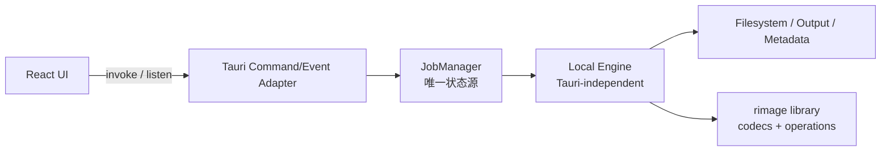

# neo-rimage 后端实装总览

> [!abstract] 本文定位
> 本文是后端实施的总入口，负责锁定架构、边界、依赖方向、阶段顺序和子 Agent 分工。具体实现要求下沉到五份子文档。历史评审见 [[rimage-core-integration-review]]；本实施方案以“在 neo-rimage 内维护本地 Engine”为最终决定，覆盖历史文档中“优先改造上游 rimage engine”的建议。

## 1. 最终架构决定

neo-rimage 将 `rimage` 作为 Rust library 静态链接进 Tauri 后端，但不依赖上游提供高层 engine。完整图片处理流程由 neo-rimage 自建的、本地维护的、与 Tauri 无关的 Engine 负责编排。

唯一允许的依赖方向：

1. Tauri adapter 依赖 JobManager。
2. JobManager 依赖本地 Engine 的任务接口。
3. 本地 Engine 依赖文件系统服务和 rimage library 的底层 codecs/operations。
4. rimage 不得反向依赖 neo-rimage、Tauri 或 GUI DTO。

明确禁止：

- 启动 `rimage.exe`、sidecar 或任何 shell 命令。
- 拼接 CLI 参数、解析 stdout/stderr、复用 Clap `ArgMatches`。
- 将 Tauri `AppHandle`、Window、EventEmitter 等类型传入 Engine。
- 复制 rimage codec 实现；只提取和维护高层 orchestration。
- 使用 `rayon::ThreadPoolBuilder::build_global()` 或其他进程级全局线程池初始化。
- 让 React 状态成为任务、队列或 worker 的权威数据源。

## 2. 后端模块边界

| 模块 | 负责 | 不负责 | 详见 |
| --- | --- | --- | --- |
| Local Engine | 单文件 decode → operations → encode → output 的确定性编排；结构化进度、取消检查、结果与错误 | 队列、公平调度、Tauri event、UI 状态 | [[01-local-engine-module]] |
| JobManager | 批次/任务生命周期、并发预算、排队、暂停、取消、重试、快照、状态转换 | 图片格式细节、输出路径拼接、Tauri DTO | [[02-job-manager-concurrency]] |
| Tauri Adapter | 命令入参校验、DTO 转换、权限边界、事件投递、错误序列化 | 业务状态、图片处理、永久缓存 | [[03-tauri-command-event-adapter]] |
| Filesystem / Output / Metadata | 输入发现、路径规范化、输出规划、冲突检查、原子落盘、EXIF/ICC/报告 | worker 调度、前端交互 | [[04-filesystem-output-metadata]] |
| Quality Plan | 测试矩阵、fixture、回归、性能基线、依赖升级与许可证检查 | 产品功能实现 | [[05-backend-quality-plan]] |

## 3. 领域模型与唯一状态源

后端应区分以下概念，不再沿用当前“Task 既代表文件又代表队列消息”的模糊模型：

- **Job / Batch**：一次 Create Task 提交，持有共同的 encoder、operations、output 与 execution 配置。
- **Task Item**：Job 中的一张输入图片，是状态、进度、错误和结果的最小持久单元。
- **Logical Worker Slot**：JobManager 暴露给 UI 的逻辑并发槽，用于展示当前并发占用；它不是永久 OS 线程，也不直接持有线程 JoinHandle。
- **Job Snapshot**：前端可读取的后端状态快照，包含 revision，用于防止乱序 event 覆盖新状态。
- **Engine Request / Result**：Engine 的内部强类型输入输出，不等于前端 DTO，也不直接序列化给 UI。

> [!important] 单一状态源
> JobManager 是任务、队列、worker、暂停/取消状态的唯一权威来源。React 只能持有快照和临时表单，刷新或重开窗口时必须能够从后端完整恢复当前运行视图。

## 4. 当前实现的替换策略

当前 `src-tauri/src/lib.rs` 中的 `Lazy<Arc<Mutex<...>>>`、crossbeam 全局队列、一 worker 一线程和占位 `process_image` 仅作为迁移输入，不作为可扩展基础继续堆叠。

迁移时按以下规则处理：

1. 先建立新领域类型和 Local Engine 边界，不直接把旧 `Task`/`ProcessWorker` 扩字段。
2. 建立 JobManager 后，再将现有 `add_task`、`get_workers` 等命令适配或迁移到新接口。
3. 新旧路径不得长期并存；完成迁移后删除全局静态队列和永久 worker 线程。
4. 前端切换完成前，可保留短期兼容命令，但兼容命令也必须读取 JobManager，禁止维护第二份状态。
5. `scan_dir` 不再 `unwrap` 任意目录项错误，输入发现统一进入文件系统服务。

## 5. rimage 依赖与来源治理

### 5.1 依赖方式

- 开发阶段可使用本地 path dependency；可复现构建必须固定到明确的 rimage Git revision 或已发布版本。
- 不启用 `build-binary`，避免引入 Clap、indicatif、console 和 CLI 专属依赖。
- 只开启 GUI 实际支持的 codec、operation、metadata、ICC 和线程特性。
- rimage 与其配套的 `zune-image` / `zune-core` 版本必须成组锁定，避免 trait/type 来自不同版本导致不兼容。
- Cargo lockfile 属于构建基线，升级必须通过 [[05-backend-quality-plan]] 的回归门禁。

### 5.2 提取边界

允许参考和改写 rimage CLI 中以下 orchestration 行为：

- 特殊格式 decoder 选择与 fallback。
- encoder 选择和强类型 options 映射。
- AutoOrient、色深、colorspace、ICC、quantize、resize 等操作顺序。
- 输出扩展名、backup、suffix、metadata 统计语义。

不得复制：

- Clap 参数声明、`ArgMatches` 和字符串参数解析。
- indicatif progress bar、console table、quiet/no-progress 等终端交互。
- CLI logger 初始化、环境参数入口和退出码处理。
- CLI 的 global Rayon pool、rayon scope 调度和进程级并发假设。

### 5.3 许可证与溯源

- rimage 为 `MIT OR Apache-2.0`；复制或实质改写的 orchestration 文件必须保留来源仓库、来源 commit、原许可证与修改说明。
- 在项目第三方声明中登记 rimage 以及被移植片段的范围，不把上游版权声明改写成 neo-rimage 自有代码。
- 每次升级 rimage 时，对照来源 commit 检查 CLI pipeline 行为变更，并更新 provenance 记录。
- 不复制 codecs/operations 源码；它们继续通过 Cargo dependency 使用。

## 6. 分阶段实施顺序

### Phase B0：冻结契约与依赖

目标：先形成可测试边界，避免 UI、队列、Engine 同时变动。

任务：

- 固定 rimage revision、features、zune 依赖组合与许可证记录。
- 定义 Job、Task Item、Engine Request/Result、结构化错误、进度和取消语义。
- 定义后端 snapshot revision 与 event 顺序约束。

交付物：领域词汇表、依赖决策记录、最小 fixture 清单。

验收：所有后续 Agent 能在不询问架构取舍的前提下开展工作。

### Phase B1：实现 Local Engine 纵向切片

目标：不经过 Tauri，完成一张图片从输入到输出的端到端处理。

任务：

- 建立 decoder、operation pipeline、encoder、output transaction 和 metadata result。
- 首先完成一个稳定 codec 的 happy path，再补齐 Create Task 暴露的 codec/options。
- 加入 stage progress、结构化错误和协作式取消检查点。

交付物：可由 Rust test 直接调用的 Engine 入口和 fixture 测试。

验收：Engine crate/module 不依赖 Tauri；失败不留下伪装成成功结果的半成品文件。

### Phase B2：实现 JobManager

目标：将单文件 Engine 包装为可控的批处理运行时。

任务：

- 实现 Job/Task 状态机、有限并发、队列暂停、任务取消、失败重试和快照。
- 将逻辑 worker slot 与执行线程解耦。
- 增加事件合并和 backpressure，避免每个像素/日志都进入 UI。

交付物：纯 Rust JobManager 测试套件和确定的状态转换表。

验收：并发额度可重复调整，不初始化 global pool；退出时能停止接单并有界等待在途任务。

### Phase B3：接入 Tauri adapter

目标：使 React 通过稳定 command/event 协议使用新后端。

任务：

- 实现命令 DTO、snapshot 查询、Job 提交/控制、输入扫描和事件桥接。
- 收敛 Tauri capabilities，只开放实际需要的能力。
- 迁移旧命令后删除全局静态队列和旧 worker 模型。

交付物：后端协议文档、Tauri 集成测试、前端可消费的事件样例。

验收：窗口刷新后可从 snapshot 重建 UI；event 丢失或乱序不会破坏最终状态。

### Phase B4：补齐可靠性与发布门禁

目标：达到可发布的稳定性和可升级性。

任务：

- 完成 codec/metadata/output/路径/错误/取消矩阵。
- 建立性能、内存、并发和 rimage 升级基线。
- 验证 debug/release、Windows 打包和真实文件权限场景。

交付物：质量报告、已知限制、升级手册和第三方声明。

验收：满足 [[05-backend-quality-plan]] 的发布门禁。

## 7. 子 Agent 工作包总表

| 工作包 | 输入 | 输出 | 前置 | 禁止越界 |
| --- | --- | --- | --- | --- |
| BE-01 Engine 契约 | Create Task 参数、rimage public API | Engine domain types 与行为契约 | B0 | 不引入 Tauri DTO |
| BE-02 Pipeline 提取 | rimage CLI pipeline、来源 commit | 本地 orchestration + provenance | BE-01 | 不复制 Clap/console/codecs |
| BE-03 Output/Metadata | 路径与 metadata 需求 | 路径规划、原子输出、报告模型 | BE-01 | 不调度任务 |
| BE-04 JobManager | Engine 接口、状态机 | 队列、并发、取消、snapshot | BE-01 | 不解析图片参数 |
| BE-05 Tauri Adapter | JobManager API、前端协议 | commands/events/DTO/ACL | BE-04 | 不保存第二份状态 |
| BE-06 Backend QA | 全部模块契约 | fixture、并发、升级、打包门禁 | 可并行启动 | 不以手工点击代替自动测试 |

分配原则：

- 每个工作包由单一 Agent 对边界负责，跨模块修改先更新契约再实施。
- Engine 与 JobManager 可以并行，但双方必须先冻结 request/result/progress/cancellation 接口。
- Filesystem/output 可以独立并行；其路径规划结果由 Engine 消费，不由 UI 重算。
- Tauri adapter 最后接入，避免 IPC 形状反向污染内部模型。

## 8. 风险与避坑

- **把本地 Engine 做成第二个 CLI**：Engine 只接受强类型配置，不引入 Clap、console、退出码或进程入口。
- **模块互相穿透**：Tauri adapter 不直接调用 codec，JobManager 不拼路径，Engine 不 emit Tauri event。
- **前后端双状态**：任何兼容命令也必须读取同一个 JobManager，不保留旧 static queue/list。
- **全局并发污染**：不初始化 global Rayon pool，不把 logical worker slot 等同于永久线程。
- **复制范围失控**：只提取 orchestration 行为，不复制 rimage codecs/operations，并保留来源与许可证。
- **一次性大爆炸迁移**：按纵向切片逐步替换，每个阶段先有契约和 fixture 再接下层消费者。
- **过早承诺即时取消和精确进度**：native codec 无观测能力时使用 CancelRequested 和不确定阶段。
- **输出安全晚补**：原子写入、冲突和 backup 必须随首个 Engine 切片一起完成。

## 9. 后端完成定义

后端只有同时满足以下条件才算完成：

- 构建产物中静态包含 rimage library，运行时不需要 `rimage.exe`。
- Engine 可脱离 Tauri 完成端到端 fixture 处理。
- JobManager 是唯一状态源，所有状态变更都有合法转换和递增 revision。
- 支持结构化进度、错误、取消和失败重试；取消语义诚实反映 codec 不可中断区间。
- 并发受统一预算控制，无 global Rayon pool、无一 worker 一永久线程。
- 输出冲突、backup、metadata 和异常落盘有明确且经测试的策略。
- rimage revision、features、来源 commit 和许可证声明可追溯。
- commands/events 契约、质量门禁和已知限制均已文档化。

## 10. 相关文档

- Engine 详细需求：[[01-local-engine-module]]
- 任务与并发：[[02-job-manager-concurrency]]
- Tauri 协议：[[03-tauri-command-event-adapter]]
- 文件与 metadata：[[04-filesystem-output-metadata]]
- 测试与升级：[[05-backend-quality-plan]]
