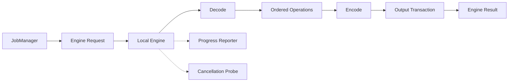

# 本地 Engine 模块实施需求

> [!summary] 目标
> 在 neo-rimage 后端内建立一个与 Tauri 完全无关的图片处理 orchestration 模块。它直接调用 rimage library 的 codecs/operations，负责单个 Task Item 的确定性处理；不启动 CLI，不承担队列调度，也不直接向前端发事件。

## 1. 模块定位

Local Engine 是 GUI 产品真正的图片处理核心，但不是 rimage 的 fork。它只维护“如何把 rimage 的底层能力组成完整文件处理流程”，底层 codec 和 operation 仍由 rimage dependency 提供。

模块必须能够在普通 Rust test 中被直接调用，不需要 Tauri runtime、webview、window 或 event bus。

## 2. 职责与边界

### 2.1 必须负责

- 将强类型 Engine Request 校验并规范化为可执行计划。
- 根据文件内容/格式选择 decoder，并处理 rimage/zune 默认 decoder 不覆盖的格式。
- 按明确顺序执行色深、colorspace、AutoOrient、ICC、resize、quantize 等 operations。
- 根据 encoder 配置创建具体 encoder，并检查配置与输入能力的兼容性。
- 调用 [[04-filesystem-output-metadata]] 提供的输出规划与事务式写入能力。
- 在稳定阶段边界产生结构化进度，不暴露 CLI 文案。
- 在安全检查点响应协作式取消。
- 返回结构化成功结果、警告或失败错误。
- 保留从 rimage CLI 提取的行为来源与版本记录。

### 2.2 明确不负责

- Job/Task 队列、并发公平性、暂停、重试策略。
- 创建永久 worker 线程或维护 worker UI 状态。
- Tauri command 参数、serde 前端 DTO、窗口事件和权限。
- Clap 参数解析、环境变量入口、终端进度、console table 和退出码。
- 全局日志初始化或全局 Rayon thread pool。
- 前端表单默认值；Engine 只执行已完成默认值归一化的请求。
- 将多个输入自动聚合为批次；一次调用只处理一个 Task Item。

## 3. 建议内部子模块

以下是职责分层，不要求拘泥于具体文件名：

| 子模块 | 责任 | 主要输出 |
| --- | --- | --- |
| Domain / Config | Engine Request、encoder/operation/output 配置、capability 描述 | 已验证的执行计划 |
| Decoder | 格式探测、普通与特殊 decoder dispatch | 内存图片、输入属性 |
| Pipeline | operation 顺序、前置条件和兼容性转换 | 可编码图片 |
| Encoder | encoder 构造、option 映射、输出格式能力 | 编码字节流或写入动作 |
| Runtime Contract | progress reporter、cancellation probe、warning sink | 与 JobManager 的稳定边界 |
| Error | 统一错误分类、上下文和可重试性 | Engine Error |
| Provenance | 来源 commit、提取范围、行为差异说明 | 可审计记录 |

文件系统、输出和 metadata 的复杂策略单列于 [[04-filesystem-output-metadata]]，但由 Engine 统一编排调用。

## 4. Engine 输入、输出与能力契约

### 4.1 Engine Request

Engine Request 至少需要表达：

- Task Item ID 与所属 Job ID，用于日志、进度和错误关联。
- 已规范化的输入路径与预先规划的输出目标。
- encoder 类型及其强类型 options。
- 有序 operation 列表，而不是若干无法表达顺序的布尔开关。
- metadata/ICC/EXIF 保留或剥离策略。
- 输出覆盖、backup、原子写入等策略的解析结果。
- 本次调用可用的取消探针、进度 reporter 和执行上下文。

Engine Request 不应包含：

- UI tab 名称、翻译字符串、表单控件状态。
- Clap subcommand、ArgMatches 或 CLI option 名称。
- Tauri AppHandle、Window、Channel 或 event 名称。
- 整个批次文件列表和 worker 数量。

### 4.2 Engine Result

成功结果至少包括：

- 输入/输出规范化路径。
- 输入与输出格式、尺寸、色深、colorspace、alpha、frame 等已知属性。
- 输入/输出字节数、压缩率、节省空间、处理耗时。
- metadata/ICC/EXIF 的实际处理结果，而不仅是用户请求值。
- 输出警告，例如部分 metadata 无法保留、动画只支持特定路径等。
- 最终完成时间以及用于聚合报告的稳定字段。

失败结果不得伪装成空成功对象。错误必须带 Task/阶段/路径上下文，并由 JobManager 决定是否可重试。

### 4.3 Capability 描述

后端应有单一的 capability 表，用于说明每个构建实际支持：

- decoder/encoder 是否启用。
- encoder 接受的 colorspace、alpha、animation、bit depth。
- 支持的 options、合法范围与后端默认值版本。
- EXIF/ICC 是否可保留。
- operations 的可用性及其前置条件。

capability 必须由 Tauri adapter 可查询，使前端根据实际后端构建启用控件；不得让前端独立硬编码一份可能漂移的能力表。

## 5. 处理流水线语义

### 5.1 固定阶段

每个 Task Item 的标准阶段为：

1. **Preflight**：再次确认输入可读、输出计划仍有效、未取消。
2. **Inspect**：读取输入文件属性并探测格式。
3. **Decode**：通过默认或特殊 decoder 得到内存图片。
4. **Normalize**：完成 encoder 前所需的方向、色深、colorspace、alpha/ICC 归一化。
5. **Operations**：严格按 Engine Request 中的顺序执行 resize、quantize 等操作。
6. **Encode**：调用选定 encoder 生成输出内容。
7. **Commit**：使用临时文件、原子替换/移动和 backup 策略提交输出。
8. **Metadata finalize**：恢复允许保留的 metadata，读取真实输出属性并生成结果。
9. **Complete**：报告终态；此后不得再修改输出或结果。

阶段名称是后端稳定枚举，不是展示文案。前端自行翻译阶段标签。

### 5.2 Operation 顺序

- 不能简单照搬 CLI “按参数在命令行出现顺序”这一行为，因为 GUI 没有参数位置。
- Create Task 应产出显式有序 operation 列表；未提供排序 UI 时，后端使用文档化的固定顺序。
- 必要的 colorspace/depth 转换属于 Normalize，不与用户 operation 混为同一层。
- Quantize 等 operation 的前置 colorspace 必须由 pipeline 自动满足，同时记录发生过隐式转换。
- AutoOrient 和 ICC/EXIF 处理顺序要通过 fixture 锁定，避免升级 rimage 后悄然变化。
- 多帧/动画图片不能默认当作静态图片悄悄丢帧；不支持时应在 preflight 明确拒绝或按已声明策略处理。

### 5.3 Decoder 选择

- 先使用内容探测或 library decoder 能力，文件扩展名只作为辅助，不作为唯一事实。
- 对 AVIF、WebP、TIFF 等特殊 decoder 采用独立 adapter，行为参考固定 rimage 来源 commit。
- 扩展名与内容冲突时返回结构化警告或错误，不得写出错误扩展名的内容。
- decoder 不支持、输入损坏、文件被替换/截断应区分错误类别。

### 5.4 Encoder 选择

- 每个 encoder 使用强类型配置，不通过 map/string 临时取值。
- option 范围在进入耗时处理前一次性校验，错误指向具体字段。
- 对未编译 feature、上游声明但实际无效的 option 返回明确 unsupported，而非静默忽略。
- output extension 和实际 encoder format 由同一 capability 定义生成。
- encoder 的 warning 和非确定性行为应进入 Engine Result/质量文档。

## 6. 进度、取消和错误

### 6.1 结构化进度

Engine 只产生领域事件，不直接 emit Tauri event。建议最小事件语义：

- StageStarted：阶段开始。
- StageProgress：阶段内有可信进度时报告有限比例；无可信比例时只报告活动状态。
- WarningRaised：非致命降级。
- StageCompleted：阶段结束与阶段耗时。

避坑：

- 不伪造 codec 内部百分比。只能观测到“开始/结束”时，就用 indeterminate 状态。
- reporter 必须轻量、非阻塞；UI 消费速度不能拖慢编码线程。
- 高频事件由 JobManager 合并/节流，Engine 不认识前端帧率。

### 6.2 协作式取消

取消检查点至少位于：

- 打开输入前。
- decode 后。
- 每个 operation 前后。
- encode 前。
- 写入/提交前。
- metadata finalize 前。

多数同步 codec 调用无法安全强制中断，因此：

- 运行中的 codec 可进入 `cancel_requested`，待安全点返回 `canceled`。
- 不使用杀线程、panic、进程终止或破坏共享内存的方式模拟即时取消。
- 如果 encode 已完成但 commit 前取消，删除临时输出，不覆盖目标。
- 如果 commit 已完成，任务应报告 completed；不得再宣称取消成功。

### 6.3 结构化错误

错误至少按以下类别区分：

- Validation：配置、能力或 option 不合法。
- Input：文件不存在、不可读、格式不支持或损坏。
- Decode / Operation / Encode：具体处理阶段失败。
- Output：目录、冲突、权限、磁盘空间、原子替换失败。
- Metadata：metadata 读取/写回失败；是否致命由策略决定。
- Canceled：协作式取消完成。
- Internal：违反不变量、依赖异常或未分类错误。

每个错误应带稳定错误码、阶段、可重试标记、用户安全消息和可选调试链。不要把 Rust Debug 文本作为前端协议。

## 7. 从 rimage CLI 提取的工作方法

### 7.1 提取前冻结来源

在开始迁移前记录：

- 来源仓库 URL。
- rimage Git commit 与 crate version。
- 参考文件清单，例如 CLI pipeline、main orchestration、path helper。
- 本次提取的具体行为及明确未提取内容。
- 选择 MIT 或 Apache-2.0 的项目合规策略。

### 7.2 行为提取，而非整文件复制

Agent 应先建立本项目的领域类型，再逐段迁移行为：

1. 将 CLI 参数读取替换为强类型 Engine Request。
2. 将 console/indicatif 调用替换为 progress reporter。
3. 将 `handle_error`/日志/早退替换为结构化 Engine Error。
4. 将 CLI 批处理/Rayon scope 去掉，只保留单文件处理。
5. 将路径和输出逻辑下沉到 [[04-filesystem-output-metadata]]。
6. 用 fixture 对比行为，而不是要求源码形状相同。

### 7.3 明确排除项

- `cli()`、subcommand、option index、`ArgMatches`。
- quiet、no-progress、terminal width、colored output。
- logger 初始化、`std::env::args`、进程退出。
- `rayon::build_global()`、CLI concurrency limiter。
- CLI 汇总表打印与 JSON 文件写入入口；保留其数据语义，改由结果模型表达。

## 8. 依赖与构建策略

- rimage 必须作为 library dependency，关闭 default features 后显式开启所需 features。
- 禁止开启 `build-binary`；若某能力只有该 feature 间接提供，应在 neo-rimage 中显式声明真正依赖，而不是为方便启用整个 CLI feature。
- rimage、zune-image、zune-core 的版本组合必须在 lockfile 与依赖决策记录中固定。
- codec native dependency 的平台构建差异进入 CI/打包矩阵。
- Engine 不自行设置进程级 panic、logger、allocator 或 Rayon global state。
- 内部并行能力服从 [[02-job-manager-concurrency]] 分配的预算，不能私自再开无界并行。

## 9. 阶段任务与交付物

### E1：契约骨架

任务：定义 Engine Request/Result、stage、error、warning、reporter、cancellation 与 capability。

交付物：领域文档、类型骨架、无 Tauri 依赖的 compile test。

验收：上层可以使用 fake Engine 开发 JobManager；配置与 UI DTO 已解耦。

### E2：单 codec 纵向切片

任务：选择一组已有稳定 fixture 的输入/encoder，打通 decode、normalize、encode、atomic output、result。

交付物：端到端 fixture 测试和输出属性断言。

验收：成功、输入损坏、输出冲突、取消四条路径均无脏文件。

### E3：operations 与 metadata

任务：接入 resize、quantize、AutoOrient、ICC/EXIF 策略，锁定顺序。

交付物：operation order 测试、方向/色彩/metadata fixture。

验收：隐式转换有记录，不支持组合在 preflight 失败。

### E4：codec 矩阵

任务：按产品优先级补齐 Create Task 暴露的 encoder 与 options。

交付物：capability 表、每 codec 正反向测试、已知限制。

验收：前端可查询的能力与实际编译 features 一致；没有静默忽略 option。

### E5：来源与升级基线

任务：完成 provenance、第三方声明、来源差异说明和升级 diff 流程。

交付物：许可证记录、rimage 升级 checklist、行为基线。

验收：新 Agent 能识别哪些代码源自上游、如何合法修改、升级时比较哪里。

## 10. 子 Agent 工作包

### BE-01A：Engine 领域契约

- 输入：Create Task 参数需求、[[00-backend-overview]]。
- 工作：定义配置层次、stage/error/result/capability 语义。
- 输出：可供 fake 实现和 JobManager 并行开发的稳定契约。
- 验收：不出现 Tauri/Clap/前端翻译类型。

### BE-01B：Pipeline 行为提取

- 输入：固定 rimage commit 的 CLI pipeline/main、BE-01A。
- 工作：迁移 decode/normalize/operation/encode 行为并保留来源说明。
- 输出：单文件 Engine 纵向切片。
- 验收：没有 CLI 专属依赖，没有 global Rayon pool。

### BE-01C：Codec Capability

- 输入：rimage public codec options、Cargo features、Create Task encoder 列表。
- 工作：建立 feature/encoder/options/metadata 能力矩阵。
- 输出：后端 capability 与测试矩阵。
- 验收：禁用 feature 时 capability 和执行结果一致。

### BE-01D：Progress / Cancel / Error

- 输入：Engine stage、[[02-job-manager-concurrency]] 的消费需求。
- 工作：实现非阻塞 reporter、协作取消检查点和错误分类。
- 输出：可注入 fake reporter/token 的测试接口。
- 验收：取消不留下临时文件；错误码不依赖 Debug 字符串。

## 11. 风险与避坑

> [!danger] 不要把 CLI 搬进 GUI
> 一旦 Engine 接收 `ArgMatches`、打印 progress bar 或自行初始化线程池，就说明边界已经失败，应停止继续扩展并重构。

- **操作顺序漂移**：用明确有序配置和 fixture 锁定，不依赖 HashMap 或 UI 控件排列偶然性。
- **多重依赖版本**：rimage 和本项目分别依赖不同 zune 版本会产生类型不兼容；依赖升级必须成组处理。
- **静默降级**：不支持的 option/metadata/animation 必须警告或失败，不能悄悄忽略。
- **假进度**：codec 无内部进度时使用不确定阶段，不展示虚假百分比。
- **取消承诺过度**：同步 native codec 不能保证毫秒级中断；UI 和协议应表现 `cancel_requested`。
- **输出半成品**：编码直接写最终路径会让失败/取消污染用户文件；必须通过 output transaction。
- **许可证遗漏**：行为提取也要保留来源与许可证，不只在复制整文件时处理。
- **重复并行**：JobManager 外层并发与 codec 内部线程叠加可能过度占用；统一遵守并发预算。

## 12. 验收清单

- [ ] Engine 模块可在无 Tauri runtime 的测试中运行。
- [ ] 运行时不存在 `rimage.exe`、sidecar、shell 或 CLI 参数解析。
- [ ] request/result/error/progress/cancel 均为强类型内部契约。
- [ ] 单文件流水线阶段和 operation 顺序已文档化并有 fixture。
- [ ] 不支持能力不会被静默忽略。
- [ ] 取消和失败不会遗留假成功输出或破坏已有目标。
- [ ] 未调用 `build_global()`，未创建永久 worker 线程。
- [ ] rimage revision/features/zune 版本已固定。
- [ ] 来源 commit、提取范围、许可证和本地修改可追溯。
- [ ] capability 能反映实际构建，供 [[03-tauri-command-event-adapter]] 查询。

