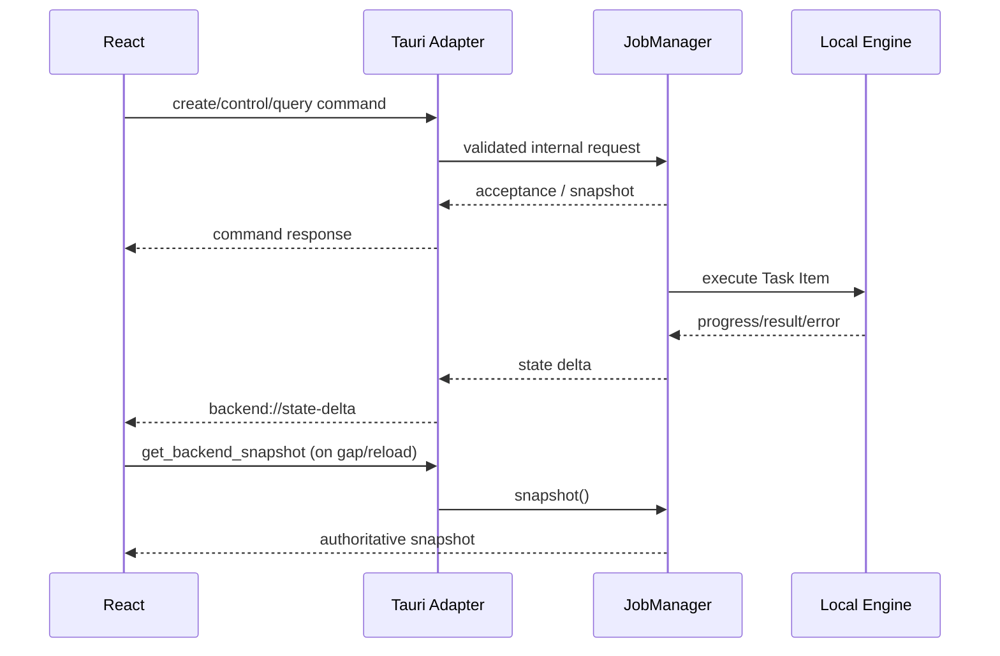

# Tauri Command 与 Event 适配层实施需求

> [!summary] 目标
> 建立薄而稳定的 Tauri IPC 边界：command 负责接收请求、校验 DTO、调用后端 service/JobManager 并返回确认；event 负责推送状态变化。业务状态只存在于 [[02-job-manager-concurrency]]，适配层不得成为第二状态源。

## 1. 适配层定位

适配层的核心价值是隔离：

- 前端 DTO 与内部领域类型分离。
- Tauri runtime 与 Local Engine 分离。
- IPC 错误与 Rust 内部错误链分离。
- event 传输与权威状态存储分离。

## 2. 职责与边界

### 2.1 必须负责

- 注册和组织 command handlers。
- 对请求执行 serde 反序列化、schema version、字段级和权限边界校验。
- 将 DTO 转换为 JobManager/文件服务的内部请求。
- 将内部 snapshot/result/error 转换为稳定的前端响应。
- 将 JobManager delta 以 Tauri event 投递给活跃窗口。
- 为每次请求附加 correlation ID，便于日志与 UI 错误对应。
- 管理 adapter subscription 生命周期与应用关闭桥接。
- 配置最小 Tauri capabilities/plugin 权限。

### 2.2 明确不负责

- 保存任务、worker、进度或队列状态。
- 直接调用 rimage codec 或 [[01-local-engine-module]]。
- 在 command handler 中同步等待整张图片处理完成。
- 根据 UI event 自行推导 task 终态。
- 扫描目录、计算输出路径或读写 metadata 的具体实现。
- 生成用户展示翻译；只返回稳定 code、参数和安全 fallback message。
- 为兼容旧 UI 维护第二套 channel/static list。

## 3. 协议设计原则

### 3.1 DTO 与内部模型分离

至少保留三层类型：

1. **Frontend DTO**：稳定、versioned、可序列化。
2. **Backend Domain**：JobManager/Engine 使用的强类型，不承诺前端兼容。
3. **Snapshot Projection**：从内部状态生成的只读 UI 投影。

不要在内部实体上直接 `derive Serialize` 后整体暴露；这样会让锁、执行器和内部字段变化变成破坏性前端协议。

### 3.2 版本与枚举

- 所有顶层 create/control 请求和 snapshot/event envelope 带 schema version。
- 新正式协议使用可读的字符串枚举，避免数字顺序变化被误解。
- 当前数字枚举可由迁移 adapter 临时接受，并严格保持既有数值语义。
- 未知 enum/字段按 schema 规则明确拒绝或忽略，不能随机 fallback 到默认 encoder。
- 破坏性变化升级 schema version，并保留一个明确的前端迁移窗口。

### 3.3 请求确认与异步执行

- `create_job` 成功只表示请求已验证并进入 JobManager，不表示图片处理完成。
- command 响应应快速返回 Job ID、revision 和当前 snapshot 摘要。
- 图片处理、目录扫描等 blocking 工作离开 Tauri 主线程/async runtime 的核心调度线程执行。
- 最终状态通过 event 和 snapshot 查询获得。

## 4. 正式 Command 面

以下命令名是建议的稳定 v1 接口；Agent 可以按项目命名规范调整前缀，但必须保持职责分组和语义不变。

### 4.1 能力与状态查询

| Command | 用途 | 返回要点 |
| --- | --- | --- |
| `get_backend_capabilities` | 查询编译 features、encoder/operation/options、并发上限、协议版本 | Capability Snapshot |
| `get_backend_snapshot` | 获取 JobManager 权威全量快照 | revision、scheduler、workers、jobs summary |
| `get_job_snapshot` | 获取指定 Job 及 Task Item 明细 | Job snapshot、当前 revision |
| `list_jobs` | 按状态/时间查询 Job 摘要 | 可分页摘要，不返回完整错误链 |

### 4.2 输入发现与预检

| Command | 用途 | 返回要点 |
| --- | --- | --- |
| `scan_inputs` | 后端扫描文件/目录、规范化、过滤、去重 | candidates、rejected、warnings |
| `validate_job_request` | 不入队地验证 encoder/options/output plan | normalized preview、field errors、collision summary |

说明：

- `scan_inputs` 统一替换前端自行递归和旧 `scan_dir` 的裸路径列表。
- 大目录扫描必须在 blocking worker 上执行，并支持取消/超时的后续演进。
- validate 结果用于表单预览，不预占输出目标；提交时仍需重新 preflight。

### 4.3 Job 创建与控制

| Command | 用途 | 规则 |
| --- | --- | --- |
| `create_job` | 固化配置并创建 Job/Task Items | 原子验证；部分输入拒绝策略由 request 明确 |
| `pause_job` | 停止该 Job 派发新 Task | 不强停 Running codec |
| `resume_job` | 恢复派发 | 保留原配置/attempt |
| `cancel_job` | 取消排队项并请求取消运行项 | 返回 CancelRequested snapshot |
| `retry_job_items` | 重试失败/可选取消项 | 重新 preflight，attempt 递增 |
| `remove_job` | 删除已终态 Job 的内存历史 | Running/CancelRequested 不允许删除 |

### 4.4 全局调度与 worker

| Command | 用途 | 规则 |
| --- | --- | --- |
| `set_scheduler_paused` | 映射全局 GO/STOP | STOP 仅停止新派发；取消使用独立命令 |
| `set_worker_count` | 设置 desired logical worker slots | 后端裁剪到 capability 上限 |

GO/STOP 的产品文案必须避免与 Cancel 混淆：

- GO：scheduler running。
- STOP：scheduler paused/draining。
- Cancel：取消 Job 或 Task Item。

## 5. 旧 Command 迁移

当前命令处理策略：

| 旧命令 | 迁移方式 | 最终状态 |
| --- | --- | --- |
| `get_cpus` | 映射到 capability 的 CPU/concurrency 信息 | 可废弃 |
| `scan_dir` | 临时包装 `scan_inputs`，只返回兼容路径 | 废弃 |
| `add_worker` | desired concurrency +1；忽略/拒绝前端 worker ID | 废弃 |
| `remove_worker` | desired concurrency -1，busy slot 进入 retiring | 废弃 |
| `get_workers` / `get_workers_len` | 从 JobManager snapshot 投影 | 废弃 |
| `add_task` | 无法表达完整 Job 配置；只允许短期前端切换期使用 | 尽快删除 |
| `get_tasks_len` | 从 snapshot 聚合 | 废弃 |
| `clear_tasks` | 替换为取消/删除终态 Job 的明确操作 | 删除 |

迁移约束：

- 兼容 handler 不得读写旧 static queue/list。
- 同一操作不能同时写旧状态和 JobManager。
- 为每个旧命令记录移除条件和前端调用点。
- 前端迁移完成后一次性删除旧命令、旧模型和无用依赖。

## 6. Event 协议

### 6.1 主状态事件

正式事件使用统一 envelope，例如 `backend://state-delta`，至少包含：

- schema version。
- 全局单调 revision。
- event kind。
- Job ID / Task ID / worker slot ID 等定位信息。
- 变更后的只读投影或必要 delta。
- backend timestamp。

建议 event kind：

- SchedulerChanged。
- WorkerSlotsChanged。
- JobChanged。
- TaskChanged。
- ProgressChanged。
- BackendShuttingDown。

统一 envelope 比大量随意命名 event 更便于版本管理、日志和前端 gap 检测。

### 6.2 Notice 事件

可另设 `backend://notice` 表达不属于某个 Task 终态的后端通知，例如：

- 依赖 capability 降级。
- 临时文件启动清理结果。
- event bridge 重新连接。
- 应用退出等待超时。

Notice 不能替代 Job/Task 状态更新。

### 6.3 顺序与恢复

- JobManager 在状态提交后产生 delta，revision 严格递增。
- adapter 必须在 manager 锁外 emit。
- 前端发现 revision 跳跃、倒退或窗口重新加载时，调用 `get_backend_snapshot`。
- snapshot revision 大于等于 event revision 时，旧 event 直接丢弃。
- 高频 progress 可以合并；terminal state、error 和 cancellation 不得合并丢失。
- event emit 失败不回滚后端状态，记录后等待前端 snapshot 恢复。

## 7. 错误响应

所有 command 使用统一错误 envelope，至少包含：

- 稳定 error code。
- error category。
- 用户安全 fallback message。
- message key 与格式化参数，供前端本地化。
- correlation ID。
- retryable。
- 可选 field errors。
- 可选 Job/Task/path 上下文；敏感路径按日志/界面策略处理。

错误处理规则：

- 不把 `anyhow`/Debug/完整 backtrace 直接发给前端。
- validation error 精确关联字段，不只返回 “invalid request”。
- internal error 对用户隐藏实现细节，但日志保留 error chain 和 correlation ID。
- command 反序列化失败、schema 不支持和 backend shutting down 使用不同 code。
- `create_job` 的整体失败与“某 Task 后续执行失败”必须区分。

## 8. 安全与 Tauri Capabilities

- 前端传入路径永远不视为已授权/已规范化，统一由 [[04-filesystem-output-metadata]] 校验。
- 如果文件发现、读取和写入已经全部放在 Rust 后端，前端 fs plugin 的宽泛 `read-all` 权限应移除或收窄。
- process plugin 只保留应用退出等实际需要；不得用于启动 rimage executable。
- 不启用 shell/dialog 等未被正式流程使用的 plugin 和权限。
- 事件 payload 不包含原始图片字节、大型 metadata blob 或无界日志。
- command 参数设置长度/数量上限，避免超大 JSON 阻塞 IPC。
- 所有窗口控制命令只操作已知主窗口，不接受任意 label。

## 9. 生命周期与初始化

### 9.1 应用启动

启动顺序：

1. 解析后端配置并确定 capability。
2. 初始化 filesystem/output service。
3. 创建单一 JobManager managed state。
4. 建立 manager → adapter event bridge。
5. 注册 commands/plugins/capabilities。
6. 创建/装饰窗口。

窗口装饰失败不应使用与图片引擎相同的错误通道，也不应导致 JobManager 重复初始化。

### 9.2 Webview 重载

- adapter subscription 可重建。
- JobManager 不重建、不清空队列。
- 前端启动后第一步查询 capability 和 snapshot，再订阅/校正 revision。

### 9.3 应用关闭

- close request 先调用 JobManager graceful shutdown。
- adapter 发 BackendShuttingDown delta/notice。
- 在有界等待结束后再让 Tauri 完成关闭。
- process plugin 不应绕过 manager 直接退出，除非用户执行明确的强制退出路径。

## 10. 阶段任务与交付物

### T1：DTO 与 schema

任务：定义 capability、create job、snapshot、state delta、error envelope 与 schema version。

交付物：前后端共享协议文档、序列化 golden fixtures。

验收：内部 domain 字段变化不会自动泄漏到 DTO。

### T2：查询与创建命令

任务：接入 capability、scan/validate、create、snapshot/list。

交付物：command handlers、字段验证、correlation logging。

验收：handler 快速返回，不同步执行完整图片任务。

### T3：控制与事件桥

任务：接入 pause/resume/cancel/retry/scheduler/worker count 和 state delta。

交付物：event bridge、revision gap 恢复测试。

验收：emit 失败不破坏后端，webview reload 可恢复。

### T4：权限和生命周期

任务：收敛 Tauri capabilities、接入 graceful shutdown、清理无用 plugin。

交付物：capability 文件、权限说明、关闭流程测试。

验收：不具备启动 sidecar/shell 的路径，fs 权限最小化。

### T5：旧命令下线

任务：提供短期 compatibility adapter、迁移前端、删除旧 handlers/static state。

交付物：deprecated 命令清单和移除记录。

验收：正式 UI 不再调用旧命令，后端只保留正式协议。

## 11. 子 Agent 工作包

### BE-03A：Protocol DTO

- 输入：前端 Create Task 需求、JobManager snapshot、Engine capability。
- 输出：versioned DTO、error envelope、序列化 fixtures。
- 验收：字符串枚举稳定，旧数字 enum 只存在迁移 adapter。

### BE-03B：Command Handlers

- 输入：DTO、JobManager/filesystem service API。
- 输出：query/create/control/scan commands。
- 验收：无 handler 直接调用 codec，blocking work 不占 Tauri 主线程。

### BE-03C：Event Bridge

- 输入：JobManager delta/revision。
- 输出：统一 state-delta/notice 事件、订阅生命周期。
- 验收：乱序、emit 失败、reload 均可通过 snapshot 恢复。

### BE-03D：Security / Migration

- 输入：现有 capabilities、旧 commands、前端调用点。
- 输出：最小权限、兼容 adapter、旧协议移除计划。
- 验收：不保留 sidecar/shell 权限，不维护双状态。

## 12. 风险与避坑

> [!danger] Command handler 不是业务服务
> 一旦 handler 开始直接 decode、维护 task vector 或控制线程，它就无法在无 Tauri 环境测试，也会把 IPC 与业务生命周期绑死。

- **command 等待任务完成**：会导致超时、窗口卡住和取消困难；只返回 accepted/snapshot。
- **使用 event 当数据库**：event 会丢，始终保留 snapshot 恢复路径。
- **内部类型直接序列化**：会锁死内部结构并泄漏实现细节。
- **数字 enum 漂移**：正式 v1 使用字符串；旧数字映射集中隔离。
- **event 在锁内 emit**：窗口重入或慢消费者会死锁 manager。
- **错误字符串协议**：前端不可通过 substring 判断错误；使用稳定 code。
- **权限过宽**：后端接管文件处理后，移除前端 `read-all` 等多余权限。
- **GO/STOP 等同取消**：STOP 是 pause/drain，取消另设命令。
- **兼容层常驻**：每个旧 command 必须有删除条件，禁止两套正式协议长期并行。

## 13. 验收清单

- [ ] 正式 commands 覆盖 capability、scan/validate、Job 创建/控制、snapshot。
- [ ] command 不同步等待图片处理完成。
- [ ] DTO、domain 和 snapshot projection 分层。
- [ ] snapshot/event/error envelope 有 schema version。
- [ ] state delta 带单调 revision，前端可检测 gap。
- [ ] event emit 在 manager 锁外，失败不回滚状态。
- [ ] webview reload 后可完整恢复任务视图。
- [ ] backend error 使用稳定 code/correlation ID，不暴露 Debug 文本。
- [ ] Tauri capability 最小化，无 shell/sidecar 启动路径。
- [ ] 旧命令只适配 JobManager，迁移后删除。
- [ ] adapter 内没有 codec、队列或第二份 task/worker 状态。

