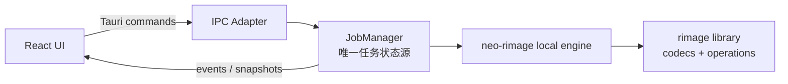

# 集成层实施总览

> [!summary]
> 集成层把前端任务意图稳定地交给后端，并由后端在同一进程中调用 `rimage` library 完成处理。正式实现不启动 `rimage.exe`，不使用 sidecar，也不解析 CLI 输出。

## 目标

- 建立 `React → Tauri IPC → JobManager → local engine → rimage library` 的唯一生产调用链。
- 让前端、IPC、队列和 engine 各自只承担一类职责，避免界面状态与实际任务状态分叉。
- 形成可独立分派、可并行开发、可按契约验收的集成工作包。
- 为进度、错误、取消、重试和最终结果提供统一语义。

## 已冻结架构

- `rimage` 以 Cargo dependency 静态编译进 Tauri 应用进程。
- 高层编排由 neo-rimage 自己维护的 local engine 提供。
- JobManager 是任务生命周期、队列状态、并发状态和取消状态的唯一事实源。
- Tauri command 只负责协议适配、输入校验和调用 JobManager。
- 前端只保存展示态和临时表单态，不自行推演后端任务状态。
- CLI、exe、sidecar、shell 参数拼接与 stdout/stderr 解析均不属于正式方案。

## 边界

### 集成层负责

- 前后端领域对象和 IPC 契约的统一。
- command、event、snapshot 的职责划分。
- JobManager 与 local engine 的协作边界。
- 任务进度、取消、错误和结果的跨层传递。
- 端到端测试入口、兼容策略和发布门禁。

### 集成层不负责

- React 组件的视觉细节与交互布局。
- codec 算法和图像 operation 的内部实现。
- 完整复制 rimage CLI 的参数解析、日志或终端体验。
- 操作系统安装包签名与商店发布流程。
- 当前版本未纳入范围的预览编辑器、云队列或远程执行。

## 依赖

- [[../01-overview/01-target-architecture|目标架构]]：确定全局模块和依赖方向。
- [[../02-frontend/00-frontend-overview|前端实施总览]]：提供表单意图、任务列表和事件消费需求。
- [[../03-backend/00-backend-overview|后端实施总览]]：提供 JobManager、engine 和持久化边界。
- [[01-domain-ipc-contracts|领域模型与 IPC 契约]]：冻结跨层数据语义。
- [[02-progress-error-cancellation|进度、错误与取消]]：冻结运行时状态传播规则。
- [[03-e2e-test-release|端到端测试与发布门禁]]：冻结整体验收方式。
- 固定 revision 的 `rimage` library 依赖及其许可证、feature 组合和平台构建条件。

## 分阶段任务

### 阶段 0：基线冻结

- 记录 `rimage` dependency revision、启用 features、支持平台和编译工具链。
- 建立跨层术语表，统一 job、task、item、worker、stage、result 等命名。
- 标记旧原型接口为迁移来源，而非未来兼容承诺。

### 阶段 1：契约先行

- 冻结 Create Task 请求、任务快照、队列快照和处理结果的领域含义。
- 划分 command 与 event；明确请求响应和异步更新各自负责的内容。
- 统一 ID、时间、路径、枚举、可选值和版本字段策略。

### 阶段 2：最小闭环

- 打通单任务、单输入、单编码器的完整链路。
- JobManager 创建任务并持有状态，engine 返回结构化结果。
- 前端能够通过初始响应和后续事件显示真实状态。

### 阶段 3：并发与控制

- 接入批量输入、受控并发、取消和失败隔离。
- 处理应用关闭、窗口重载、事件丢失和状态重新同步。
- 确保 worker 数量只是 JobManager 的执行策略，不成为第二套状态模型。

### 阶段 4：兼容与发布

- 增加契约回归、真实 fixture、平台构建和安装包冒烟测试。
- 建立 rimage 升级检查清单与差异审计流程。
- 通过发布门禁后再开放更多 encoder options。

## 交付物

- 一份经前后端共同确认的领域模型与 IPC 契约。
- 可运行的 JobManager—engine—rimage library 单进程链路。
- 可恢复任务列表的 snapshot/event 同步机制。
- 结构化进度、错误、取消和结果模型。
- Windows 主平台端到端测试集与跨平台构建检查。
- 第三方来源、依赖 revision 和升级流程记录。

## 验收标准

- 应用运行期间不存在启动 `rimage.exe` 或其他处理 sidecar 的路径。
- 所有任务状态都能追溯到 JobManager，前端刷新后可重新拉取一致快照。
- command 返回与 event 更新不会产生互相矛盾的任务状态。
- 同一任务只能有一个终态，取消、失败、成功不能重复覆盖。
- engine 可在不启动 Tauri 和前端的情况下被后端测试独立调用。
- rimage 依赖升级前后，固定 fixture 的输出行为和错误分类可比较。

## 避坑点

> [!warning] 不要复刻 CLI
> 只提取高层处理语义，不复制 Clap、终端进度条、日志格式、全局线程池或 CLI 字符串参数。

- 不允许 UI 点击后直接假设任务已成功创建；必须以 JobManager 返回为准。
- 不让 event 成为唯一数据源；事件可能丢失，snapshot 必须能重建界面。
- 不把路径当作全局唯一任务 ID；同一路径可能被重复处理或输出为不同格式。
- 不在 command handler 内执行长时间图片处理，避免阻塞 IPC 和窗口生命周期。
- 不让 local engine 依赖 Tauri 类型，否则难以独立测试和复用。
- 不盲目追踪 rimage 主分支；固定 revision 并显式评估升级。
- 不把 encoder-specific 参数塞入无类型键值表；这会把校验问题推迟到运行时。

## 可分派工作包

| 工作包 | 负责人建议 | 前置依赖 | 产出 | 可并行性 |
| --- | --- | --- | --- | --- |
| INT-01 术语与领域模型冻结 | 架构/前后端联合 | 无 | 领域词典、状态机、DTO 清单 | 可先行 |
| INT-02 IPC command 契约 | 后端 + 前端接口负责人 | INT-01 | command 清单、请求响应语义 | 与 INT-03 并行 |
| INT-03 event 与 snapshot 契约 | 后端 + 前端状态负责人 | INT-01 | 事件清单、重同步规则 | 与 INT-02 并行 |
| INT-04 JobManager 接线 | 后端任务系统负责人 | INT-01/02 | 创建、查询、取消闭环 | 与 UI mock 并行 |
| INT-05 engine 适配 | 图像管线负责人 | INT-01 | 强类型配置到 rimage 调用链 | 与 INT-04 并行 |
| INT-06 前端真实数据接入 | 前端状态负责人 | INT-02/03/04 | invoke、订阅、快照恢复 | 后置 |
| INT-07 E2E 与发布门禁 | QA/构建负责人 | 最小闭环完成 | fixture、冒烟、构建矩阵 | 持续推进 |

## 导航

- 下一步：[[01-domain-ipc-contracts|领域模型与 IPC 契约]]
- 运行时语义：[[02-progress-error-cancellation|进度、错误与取消]]
- 验收与发布：[[03-e2e-test-release|端到端测试与发布门禁]]
