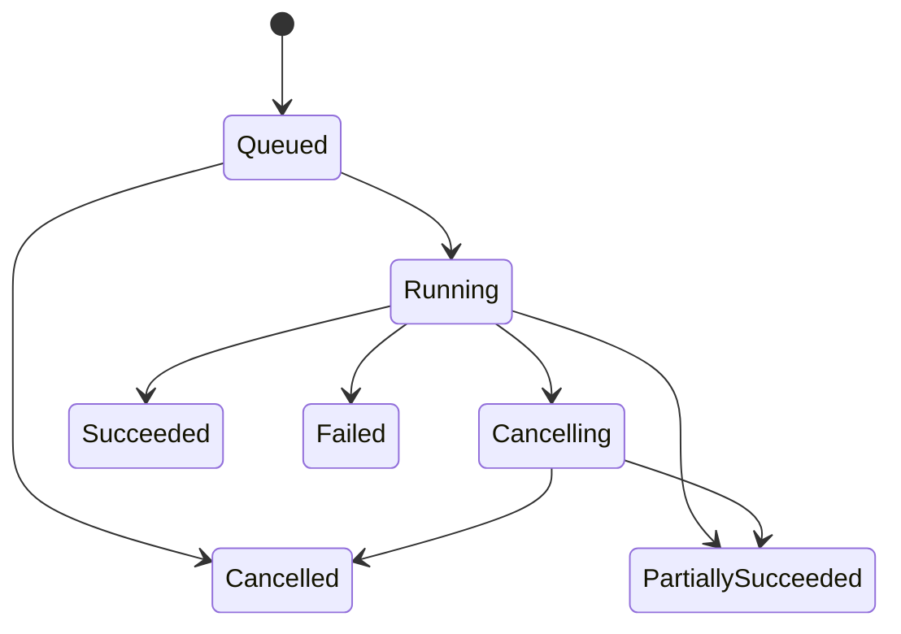

# 进度、错误与取消

> [!summary]
> JobManager 持有任务运行状态；local engine 只报告事实并响应取消。前端通过事件获得及时反馈，通过快照获得权威状态。取消是协作式控制，不等同于立即终止线程。

## 目标

- 为批量图片任务建立稳定、可理解且可恢复的状态传播模型。
- 让进度具备明确分母和阶段语义，避免 UI 显示虚假精度。
- 将用户错误、输入错误、编码错误、系统错误和内部错误结构化分类。
- 确保取消在排队、运行、写文件和终态竞争下都有确定行为。

## 边界

### 本文覆盖

- job 与 item 两级状态。
- 阶段进度、总体进度、吞吐和结果计数。
- 错误分类、可重试性、用户展示与诊断上下文。
- 取消请求、取消确认、检查点和竞态处理。
- JobManager、engine、IPC 与 UI 的责任划分。

### 本文不覆盖

- 操作系统级强杀线程或进程。
- codec 算法内部的细粒度进度改造。
- 自动重试策略的具体次数与退避参数。
- 日志后端、遥测平台或隐私政策实现。

## 依赖

- [[00-integration-overview|集成层实施总览]]：冻结单进程调用链和 JobManager 状态权威。
- [[01-domain-ipc-contracts|领域模型与 IPC 契约]]：提供 snapshot、event、result 和 revision 规则。
- local engine：提供阶段边界、处理结果和协作式取消检查点。
- rimage library：决定 codec 操作是否可中断、错误信息可提取程度及文件写入行为。

## 状态模型

### Job 级状态

建议使用单向生命周期：

约束：

- 终态不可逆：`Succeeded`、`PartiallySucceeded`、`Failed`、`Cancelled`。
- “取消已受理”与“任务已取消”是两个不同状态。
- 部分成功用于批量任务已有有效输出但仍存在失败或取消项的情况。
- 重试创建新的执行记录，并关联来源任务；不把终态任务改回运行态。

### Item 级状态

- `Queued`：尚未进入 engine。
- `Running`：已经占用执行槽。
- `Succeeded`：输出已按策略成功提交。
- `Failed`：单项不可继续，但不必拖垮其他 item。
- `Cancelled`：在开始前或检查点后停止。
- `Skipped`：因明确策略未处理，例如输出已存在且禁止覆盖。

Job 状态由 item 终态与任务级错误归约得出，只能由 JobManager 计算。

## 进度模型

### 两级进度

- Job 总体进度：以已进入终态的 item 数量为主要可靠指标。
- Item 当前进度：以处理阶段为主，codec 不提供可信百分比时不伪造连续百分比。

### 建议阶段

- 准备输入与校验。
- 读取与解码。
- 图像操作与转换。
- 编码。
- 写入临时输出。
- 原子提交输出与元数据收尾。

阶段名称是产品契约，不应直接暴露内部函数名。首版允许阶段权重为空；UI 可以使用不确定进度表现。

### 进度事件节流

- engine 可以高频报告，但 JobManager 负责合并与限频。
- 终态、阶段切换和错误事件不得被节流丢弃。
- 高频字节或百分比变化只保留最新值，避免 IPC 堆积拖慢实际处理。
- UI 按 job ID、item ID 和 revision 合并，不按事件到达时间推断顺序。

## 错误模型

### 分类

| 类别 | 典型含义 | 默认可重试性 | 归属 |
| --- | --- | --- | --- |
| Validation | 参数矛盾、范围非法、能力不支持 | 否 | IPC adapter/JobManager |
| Input | 路径不存在、权限不足、格式不支持、文件损坏 | 通常否 | engine |
| Processing | resize、quantize、颜色或元数据处理失败 | 视原因 | engine/rimage |
| Encoding | encoder 初始化或编码失败 | 视原因 | engine/rimage |
| Output | 目录、覆盖、临时文件、写入或提交失败 | 常可重试 | engine |
| Cancelled | 用户或应用生命周期触发取消 | 否 | JobManager/engine |
| Internal | 状态不变量破坏、无法分类的异常 | 否并需诊断 | 各层 |

### 跨层错误内容

- 稳定错误码：供 UI 行为、测试和兼容判断。
- 类别与发生阶段。
- 面向用户的参数化上下文，不携带预本地化整句。
- 可重试提示，但最终是否允许重试由 JobManager 根据状态决定。
- 可选诊断 ID，用于关联日志；不要把完整 backtrace 直接发给 UI。
- item 级错误需关联 job ID 和 item ID。

### 错误传播原则

- engine 将 rimage 和 I/O 错误归一化，不向上泄漏无法稳定匹配的第三方文本。
- JobManager 决定错误影响单个 item 还是整个 job。
- IPC adapter 只负责安全序列化，不重新解释业务错误。
- UI 根据错误码选择本地化文案，并保留“复制诊断信息”的入口。

## 取消语义

### 取消请求流程

1. UI 发送 job 取消意图。
2. JobManager 校验任务是否可取消，并标记取消请求。
3. 未开始的 item 直接进入取消终态。
4. 运行中的 engine 在安全检查点观察取消标记。
5. JobManager 收集 item 结果并归约 job 终态。
6. UI 通过 event 获得更新；必要时以 snapshot 对账。

### 安全检查点

- 进入解码前。
- operation 链各阶段之间。
- 进入耗时编码前及编码完成后。
- 写临时文件前。
- 将临时输出提交为最终文件前。

若第三方 codec 调用本身不可中断，UI 必须显示“正在取消”，等待调用返回；不得声称已经停止。

### 输出完整性

- 最终输出应通过临时文件或等价事务策略提交。
- 取消或失败不得留下伪装为成功输出的半文件。
- 已成功提交的 item 不因同一 job 后续取消而删除，除非产品另有明确的全量回滚需求。
- backup、overwrite 和 suffix 策略必须在取消路径中保持一致。

## 应用生命周期

- 窗口关闭与应用退出是不同事件；仅隐藏窗口时不应自动取消任务。
- 真正退出时，首版推荐请求取消并等待有限的安全收尾窗口。
- 若无法保证跨重启恢复，应用退出前应明确告知仍在运行的任务。
- 前端窗口刷新或崩溃不应自动终止后端任务；恢复后通过 snapshot 重建状态。
- 后端进程意外终止后，残留临时文件需要在下次启动时识别并安全清理或提示。

## 分阶段任务

### 阶段 1：状态与错误字典

- 冻结 job/item 状态、允许转换与终态归约表。
- 定义错误类别、错误码命名和用户可见上下文。
- 明确部分成功、跳过和取消的产品含义。

### 阶段 2：最小进度链路

- engine 报告阶段变化和 item 结论。
- JobManager 生成 job 总体计数与 revision。
- UI 能展示排队、运行和终态，不依赖虚构百分比。

### 阶段 3：协作式取消

- 建立取消 token 与安全检查点。
- 覆盖排队取消、运行取消、codec 不可中断和输出提交竞态。
- 加入应用退出收尾策略。

### 阶段 4：恢复与诊断

- 实施事件节流、snapshot 对账和前端重连。
- 建立诊断 ID、结构化日志关联与临时文件清理。
- 为典型失败提供 retry eligibility 测试。

## 交付物

- job/item 状态机与终态归约表。
- 处理阶段词典和进度事件策略。
- 稳定错误码目录与 UI 本地化映射需求。
- 取消检查点、退出收尾和输出完整性规范。
- 状态转换、取消竞态和错误归一化测试集。
- 用户可见行为说明，包括“正在取消”和部分成功。

## 验收标准

- 任意 job 和 item 的状态转换都符合已冻结状态机。
- 取消 command 成功只表示已受理，UI 不会提前显示已取消。
- 对不可中断 codec 调用，应用保持响应并在调用结束后完成取消归约。
- 失败或取消不会留下被识别为成功结果的半写入文件。
- 单项输入错误不会无条件终止整个批次。
- 前端丢失进度事件后可以用 snapshot 获取正确终态和计数。
- 相同底层错误在不同入口产生相同的稳定错误码。

## 避坑点

> [!warning] 线程不是取消边界
> Rust 无法安全强杀任意工作线程。不要为“立即取消”引入不安全线程终止；使用协作式取消和明确的等待状态。

- 不把进度百分比当状态；100% 后写入仍可能失败。
- 不让 engine 直接发 Tauri event，否则业务逻辑会被运行时绑死。
- 不用错误文本作为程序分支条件；第三方版本升级会改变文本。
- 不在取消时直接删除可能仍被 codec 或 writer 使用的文件。
- 不让每个 worker 自行决定 job 终态；统一交给 JobManager 归约。
- 不无限制广播高频进度，IPC 队列会反过来阻塞处理。
- 不在 UI 本地重算成功/失败总数，避免与后端统计不一致。

## 可分派工作包

| 工作包 | 任务 | 依赖 | 验收焦点 |
| --- | --- | --- | --- |
| RUN-01 状态机与归约 | 冻结 job/item 转换和批量结果规则 | [[01-domain-ipc-contracts]] | 终态唯一 |
| RUN-02 进度报告接口 | 定义 engine 到 JobManager 的阶段与结果报告 | RUN-01 | 不依赖 Tauri |
| RUN-03 事件合并与节流 | 设计 revision、合并和发送频率 | RUN-02 | 无事件风暴 |
| RUN-04 错误归一化 | 建立底层错误到稳定错误码映射 | RUN-01 | 文本不参与逻辑 |
| RUN-05 协作式取消 | 建立 token、检查点和竞态测试 | RUN-01/02 | 不产生半文件 |
| RUN-06 生命周期收尾 | 处理窗口重载、退出和临时文件 | RUN-05 | 恢复行为明确 |

## 导航

- 架构入口：[[00-integration-overview|集成层实施总览]]
- 数据契约：[[01-domain-ipc-contracts|领域模型与 IPC 契约]]
- 验收场景：[[03-e2e-test-release|端到端测试与发布门禁]]

