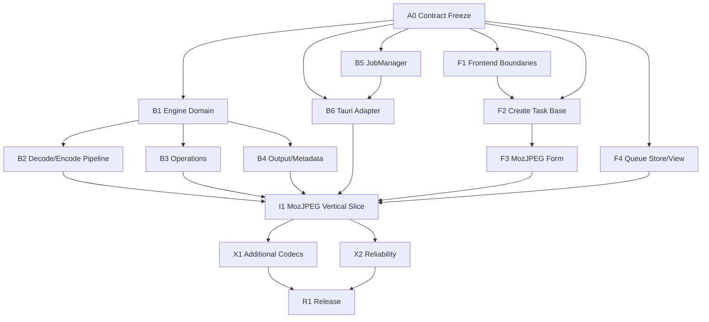

# neo-rimage 子 Agent 工作包

> [!important] 使用规则
> 每个工作包是独立授权边界。Agent 不得自行扩大修改范围、改变架构决策或重新定义跨端 contract。所有工作包交付都必须满足 [[docs/implementation/05-execution/01-definition-of-done|Definition of Done]]。

## 1. 依赖总图

## 2. 架构与契约工作包

### A0 — Domain/IPC v1 冻结

| 项目 | 内容 |
| --- | --- |
| Owner 类型 | 架构/集成 Agent |
| 前置依赖 | 现状评审、目标架构 |
| 允许修改 | contract 文档；后续约定的前后端 contract 类型目录 |
| 禁止修改 | engine 业务、UI 组件、队列实现 |
| 输入 | Create Task 参数清单、任务状态图、错误/取消需求 |
| 输出 | v1 request/snapshot/event/error 字段、默认值、版本与兼容规则 |
| 验收 | 前后端 Agent 无需自行猜测任何跨端字段或状态语义 |
| 并行性 | 关键路径；完成前只允许骨架性并行工作 |

避坑：不要把第三方 rimage options 或前端 form object 原样作为 IPC；不要用数字 enum；不要把高频 progress 当完整 snapshot。

### A1 — rimage 依赖与来源基线

| 项目 | 内容 |
| --- | --- |
| Owner 类型 | Backend/Release Agent |
| 前置依赖 | A0 可并行进行 |
| 允许修改 | Cargo dependency、许可/来源文档、fixture 基线配置 |
| 禁止修改 | codec 源码、上游仓库历史 |
| 输入 | rimage v0.12.4/目标 revision、feature matrix |
| 输出 | 可复现依赖方式、来源 commit、许可记录、升级检查入口 |
| 验收 | Release 不依赖开发机绝对路径；本地开发仍可方便 patch |
| 并行性 | 可与 B1/F1 并行 |

## 3. 后端工作包

### B1 — Local Engine Domain 与边界

- **前置**：A0。
- **允许修改**：`src-tauri` 下 engine/domain 新模块及其测试。
- **禁止**：Tauri emit、窗口 API、队列调度、CLI ArgMatches。
- **交付**：JobSpec、EncoderConfig、Operations、OutputOptions、EngineError、ProgressReporter、Cancellation 语义边界。
- **验收**：Engine 可以在无 Tauri runtime 的测试中被调用；类型不泄漏 React/Tauri 概念。
- **可并行**：与 F1、B5 骨架并行。

### B2 — Decode/Encode Pipeline

- **前置**：B1、A1。
- **输入**：rimage CLI decode/encoder mapping 与 fixture。
- **交付**：统一 decode dispatch、encoder adapter、颜色空间/bit depth 准备和结构化结果。
- **禁止**：复制 Clap、indicatif、console；复制 codec 实现；使用 rimage exe。
- **验收**：最小 MozJPEG fixture 可 decode → encode；错误不会 panic Tauri 进程。
- **可并行**：与 B3、B4 并行，但共同 contract 由 B1 管理。

### B3 — Ordered Operations

- **前置**：B1。
- **交付**：resize、quantize、dithering、premultiply 的有序执行语义和验证。
- **验收**：operation 顺序可被测试证明；无效组合在执行前失败。
- **避坑**：不要保留 `resizeFirstly` 布尔捷径；不要把 CLI 参数出现位置逻辑带入 domain。

### B4 — Filesystem、Output 与 Metadata

- **前置**：B1、A0 output semantics。
- **交付**：路径规范化、输出计算、suffix、preserve structure、backup、metadata、临时文件/原子替换策略。
- **验收**：同名、多目录、无权限、已存在输出、磁盘错误有明确结果；源文件不会因失败丢失。
- **禁止**：让前端决定最终输出路径；在多个 command 中分别拼路径。

### B5 — JobManager 与 Concurrency

- **前置**：A0 状态/取消语义。
- **交付**：queue、task lifecycle、snapshot revision、有界执行器、取消令牌、retry/pause 基础。
- **验收**：假 engine 可验证全部状态转换；高并发请求不会创建无界线程。
- **避坑**：禁止 `rayon::build_global()`；禁止以永久线程 ID 作为产品 worker identity。

### B6 — Tauri Commands 与 Events

- **前置**：A0、B5；可先接 fake manager。
- **交付**：薄 command adapter、event payload、startup snapshot、重同步接口和权限最小化。
- **验收**：commands 不含 pipeline 规则；事件丢失后前端可通过 snapshot 恢复。
- **禁止**：在 command 内直接修改前端概念状态；发送事件作为唯一持久状态。

### B7 — Backend Quality Gate

- **前置**：B1-B6 按模块逐步接入。
- **交付**：unit/fixture/integration/fault tests，panic/error audit，并发和内存验证报告。
- **验收**：满足 [[docs/implementation/03-backend/05-backend-quality-plan|后端质量计划]]。

## 4. 前端工作包

### F1 — Frontend Boundaries 与 IPC Client

- **前置**：A0 草案。
- **允许修改**：frontend app/features/ipc/domain/stores 目录和迁移所需入口。
- **交付**：form state、UI state、backend snapshot state 分层；统一 commands/events client。
- **验收**：组件不直接散落 invoke/listen；前端没有 task/worker 权威写入口。
- **可并行**：与 B1/B5 并行。

### F2 — Create Task 基础闭环

- **前置**：F1、A0。
- **交付**：稳定 form state、输入清单、encoder 选择、Create/Cancel、校验摘要和 request 构造。
- **验收**：表单不会因 render 重置；提交成功后使用后端返回 snapshot；失败保留用户输入。
- **禁止**：直接 push taskList；显示尚未生效的控件。

### F3 — MozJPEG 与 Resize 最小面板

- **前置**：F2、MozJPEG contract。
- **交付**：首个完整 codec panel，参数范围/默认值/依赖关系与后端一致。
- **验收**：所有可见控件进入 request；fixture 能证明关键参数生效。
- **可并行**：可与 B2/B3 开发并行，在 I1 集成。

### F4 — Queue/Task Snapshot Store 与视图

- **前置**：A0 snapshot/event contract；可使用 fixtures/mock。
- **交付**：初始化 snapshot、revision/event merge、重同步、task table、queue controls。
- **验收**：乱序/丢失事件不会产生永久错误状态；刷新后恢复真实队列。

### F5 — Worker Slots、Progress 与任务动作

- **前置**：F4、B5/B6 contract。
- **交付**：执行槽监视、progress、cancel/retry/remove/clear 的意图交互。
- **验收**：UI 不生成 worker ID；动作按钮根据后端状态正确启用。

### F6 — Native Shell、Settings 与 i18n

- **前置**：F1；文件入口需 A0 inputs contract。
- **交付**：文件选择/拖放入口、窗口行为、并发设置、语言/文案和全局错误呈现。
- **验收**：原生 API 统一收口；中英日布局与关键流程可用。

### F7 — Frontend Quality Gate

- **前置**：随 F1-F6 持续进行。
- **交付**：domain/store/component/IPC/E2E/visual/a11y 测试证据。
- **验收**：满足 [[docs/implementation/02-frontend/04-frontend-quality-plan|前端质量计划]]。

## 5. 集成工作包

### I1 — MozJPEG Vertical Slice

- **前置**：B2、B3、B4 最小范围，B5、B6，F2-F4。
- **交付**：Create → queue → engine → output → result 的完整链路。
- **验收**：真实文件输出、进度、错误、取消和 UI snapshot 一致；不依赖 rimage exe。
- **并行性**：集成阶段应由一个 owner 控制，其他 Agent 只修复自己的模块。

### I2 — Output/Operations Integration

- **前置**：I1。
- **交付**：完整 resize、quantization、output、backup、metadata 的跨端闭环。
- **验收**：failure matrix 和 fixture matrix 通过。

### I3 — Additional Codecs

- **前置**：I1 contract 模式稳定。
- **交付**：JPEG/OxiPNG/WebP/AVIF 等按独立小工作包接入。
- **验收**：每个 codec 独立通过 config、mapping、UI、fixture 和错误说明。

### R1 — Release Readiness

- **前置**：关键功能与可靠性 gate。
- **交付**：固定依赖、许可、MSI/NSIS、干净机器验证、升级流程。
- **验收**：满足 [[docs/implementation/04-integration/03-e2e-test-release|端到端测试与发布]]。

## 6. 分配建议

| Agent | 首选工作包 | 可并行伙伴 |
| --- | --- | --- |
| Architecture Agent | A0、契约变更评审 | 全部 |
| Backend Engine Agent | B1-B4 | Frontend Form、QA fixtures |
| Backend Runtime Agent | B5-B6 | Queue UI、Integration |
| Frontend Form Agent | F1-F3 | Engine Agent |
| Frontend Runtime Agent | F4-F6 | JobManager Agent |
| QA/Integration Agent | B7、F7、I1-I3 | 所有模块 owner |
| Release Agent | A1、R1 | Backend/Integration |

