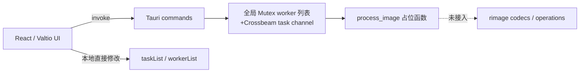
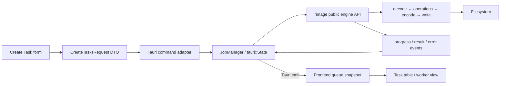

# neo-rimage × rimage 核心集成设计评审

> [!important] 最终实装架构更新
> 本文记录的是最初源码评审和参数盘点，其中“优先在上游 rimage 增加 public engine”的建议已被后续决策替代。最终方案是在 **neo-rimage 内维护 Tauri-independent local engine**，底层将 rimage 作为 Rust library 静态链接；不调用 rimage CLI exe，也不要求上游先提供 `rimage::engine`。正式实施以 [[docs/implementation/00-index|neo-rimage 实装计划索引]] 和 [[docs/implementation/01-overview/01-target-architecture|目标架构]] 为准。

> 评审日期：2026-07-10  
> GUI 基线：`neo-rimage` `main`（`bb403a4`）  
> 核心基线：`rimage` `v0.12.4`（`0078ef7`）  
> 评审范围：当前项目结构、GUI 与 rimage 的集成边界、Create Task 未实现参数

## 1. 结论摘要

将 `D:\Projects\Rust\rimage` 作为 neo-rimage 的图片处理核心是可行的，但**不能只在 `src-tauri/Cargo.toml` 中添加一个 path dependency 就完成集成**。

当前 `rimage` 的代码实际分成两层：

- library crate 暴露低层 codecs 和 operations；
- 完整的文件处理流水线、输出路径、元数据、EXIF/ICC、并发和 CLI 参数映射位于 binary 私有的 `src/main.rs` 与 `src/cli/**`，library 调用方不能直接复用。

因此建议先在 rimage 中增加公开的高层 engine API，或拆出 `rimage-core` crate。CLI 和 GUI 都只负责把各自的输入转换为同一份任务配置，不再分别维护处理流程。

当前 GUI 应视为 UI/交互原型，尚不是可接入真实核心的任务系统，主要原因是：

1. Create Task 没有确认/创建动作，配置不会生成任务。
2. GO/STOP 只切换前端布尔值，没有向 Rust 队列提交或取消任务。
3. Rust `process_image` 仍是占位函数，Rust `Task` 也不包含编码与预处理配置。
4. 前端和 Rust 各自保存 worker/task 状态，缺少唯一数据源和状态事件。
5. 当前“一 worker 一 OS 线程”会与 rimage/codec 自身的多线程能力重叠，存在过度并发和内存失控风险。

## 2. 当前结构评审

### 2.1 当前数据流



### 2.2 结构中合理的部分

- Tauri 2 + React 19 适合作为桌面 GUI 技术栈。
- UI、Tauri adapter 和图片核心在目录上已经具备分层基础。
- 拖放、任务缓存、worker 面板和多语言界面可以保留为产品交互基础。
- rimage 已经提供 AVIF、MozJPEG、OxiPNG、WebP 编码器以及 resize、quantize、ICC 等低层能力。
- rimage 的 CLI 参数已经形成较完整的产品语义，可作为 GUI 参数设计的基准。

### 2.3 主要不合理点

| 优先级 | 问题 | 当前影响 | 建议 |
| --- | --- | --- | --- |
| P0 | rimage 的完整 pipeline 不属于 public library API | GUI 若直接集成，需要复制 `main.rs`/`cli/pipeline.rs` 的逻辑 | 在 rimage 中抽取公开 engine 层，CLI 与 GUI 共用 |
| P0 | Create Task 无提交闭环 | 用户配置无法进入 `taskList`，更不会调用 Rust | 增加 validate → create task → enqueue 的明确动作 |
| P0 | GO/STOP 未连接后端 | `running` 只是前端状态，不能启动或停止处理 | 改为 `start_queue`/`pause_queue`/`cancel_task` 等后端命令 |
| P0 | Rust `Task` 与 TS `TaskConfig` 不一致 | 编码器、resize、输出设置全部在 IPC 时丢失 | 定义版本化 DTO，并通过 tagged enum 表达 encoder config |
| P1 | 前后端双重保存 task/worker 状态 | 重启、异常、并发更新时必然漂移 | 后端 JobManager 作为唯一数据源，前端只保存快照 |
| P1 | 数字枚举作为协议 | 插入/调整枚举顺序会静默改变含义 | IPC 使用字符串 tagged enum，例如 `{ kind: "mozjpeg" }` |
| P1 | 一 worker 一线程 + codec 内部线程 | 容易形成嵌套并行、过量 CPU/RAM 占用 | 使用固定并发预算、局部 rayon pool 或 semaphore |
| P1 | rimage CLI 使用 `rayon::build_global().unwrap()` | GUI 是长生命周期进程，动态修改并发时无法重复初始化 global pool | engine 使用私有 ThreadPool，不构建 global pool |
| P1 | `defConfig` 在 CreateTaskDialog 每次 render 时重新创建 | 表单更新触发 render 后可能重置未提交配置 | 使用稳定的 form state、`useRef`/`useReducer` 或表单库 |
| P1 | Tauri Rust 全局状态大量 `unwrap()` | 目录无权限、worker 退出或锁中毒会导致 panic | 所有命令返回结构化 `Result`，错误通过事件/Toast 展示 |
| P1 | worker 状态从未在处理期间更新 | Busy/Done、当前文件和进度都不可信 | engine 产生 progress event，JobManager 更新状态并 emit |
| P1 | `JoinHandle` 不 join，移除 worker 只发送 stop | 处理中的线程不能及时停止，退出状态不确定 | 改为任务级取消令牌与可管理的执行器生命周期 |
| P1 | 前端使用 `fs:read-all` 并自行 stat，后端又扫描目录 | IO 职责重复，权限范围过宽 | 文件发现、规范化和校验统一放入 Rust engine/backend |
| P2 | `App.tsx` 同时包含原生事件、业务命令和页面布局 | 后续接入核心后难以测试和维护 | 拆为 app shell、queue controller、drop controller、views |
| P2 | `type.tsx`/`State.tsx` 同时承载协议和 UI 状态 | domain、IPC、view state 混在一起 | 拆分 `domain/`、`ipc/`、`store/`，非 JSX 文件改为 `.ts` |

其他具体问题：

- `scan_dir` 对 `WalkDir` 错误直接 `unwrap()`，遇到无权限目录可导致 Tauri 进程 panic。
- Task cache 按 `fileName` 删除，同名但不同路径的文件会被同时删除；应使用规范化完整路径或 task id。
- 文件类型由前端 `mime` 按扩展名过滤，可能拒绝 rimage 支持但 MIME 数据库未识别的格式；支持格式应由核心统一判断。
- `recursiveFolders` 表示“扫描输入目录”，`TaskConfig.recursive` 表示“输出目录保留结构”，两者语义不同但命名相近，容易误用。
- 当前 `ProcessWorker.task` 和 `status` 从未由 Rust 处理线程实时维护，`get_workers` 返回值不具备真实运行含义。

## 3. 推荐目标架构



### 3.1 rimage 侧建议

优先选择以下一种方式：

1. **推荐：在 rimage crate 内增加 `engine` public module**。
2. 若希望明确隔离低层 codec 与应用流水线，则新增 workspace crate `rimage-core`。

engine 至少应公开：

- `JobSpec`：单文件或批处理任务的完整配置；
- `EncoderConfig`：带类型标签的编码器配置枚举；
- `PreprocessOperation`：有序 resize、quantize、premultiply 操作；
- `OutputOptions`：目录、结构保留、suffix、backup、metadata；
- `ExecutionOptions`：外层文件并发、取消令牌；
- `ProgressEvent`、`JobResult`、`EngineError`；
- `process_one` 与 `process_batch`，或等价的可测试接口。

以下逻辑应从 binary 私有代码移动到 engine，而不是在 GUI 中复制：

- AVIF/WebP/TIFF 与 zune-image 的统一 decode dispatch；
- encoder options 到实际编码器的映射；
- AutoOrient、ICC、颜色空间与 bit depth 处理；
- 输出扩展名、suffix、backup 与目录结构计算；
- EXIF/ICC 保留与 strip 行为；
- 批处理结果、压缩率和 metadata 统计；
- 路径规范化、冲突处理和结构化错误。

CLI 的 Clap 参数只负责转换成 `JobSpec`。这样 CLI 与 GUI 的结果才能保持一致。

### 3.2 neo-rimage Rust 侧建议

用 `tauri::State<AppEngine>` 代替静态全局变量：

```text
AppEngine
├── job_manager
│   ├── queue
│   ├── task snapshots
│   └── cancellation tokens
├── execution_pool
└── rimage engine
```

建议的 Tauri 接口：

- `create_tasks(request) -> Vec<TaskSnapshot>`
- `start_queue() -> QueueSnapshot`
- `pause_queue() -> QueueSnapshot`
- `cancel_task(task_id) -> TaskSnapshot`
- `remove_task(task_id)`
- `clear_finished_tasks()`
- `set_concurrency(value)`
- `get_queue_snapshot()`

建议事件：

- `queue://updated`
- `task://updated`
- `task://progress`
- `task://completed`
- `task://failed`

不要把“增加/删除 worker 线程”作为主要业务 API。UI 可以展示逻辑 worker slot，但并发数量应由统一的 concurrency 设置控制。

### 3.3 依赖方式

本地验证可以临时使用：

```toml
rimage = { path = "../../../Rust/rimage", default-features = false, features = [
  "resize",
  "quantization",
  "mozjpeg",
  "oxipng",
  "webp",
  "avif",
  "tiff",
  "threads",
  "metadata",
  "icc",
] }
```

但这个 sibling path 不适合作为可发布方案。最终应使用以下之一：

- 固定 tag/revision 的 Git dependency；
- 将 rimage 作为仓库 submodule/vendor workspace member；
- 发布包含 engine API 的 crates.io 版本。

注意：rimage 当前 default features 不包含 `icc`，而 CLI 的 `build-binary` 间接启用了它。若 GUI 要复用 CLI 同等行为，engine feature 需要明确包含 ICC、AutoOrient、EXIF 等依赖。

## 4. 建议的任务协议

不要继续让 TS 数字枚举与 Rust `repr(u8)` 枚举直接对应。建议使用类似以下的字符串协议：

```ts
type EncoderConfig =
  | { kind: "mozjpeg"; options: MozjpegOptions }
  | { kind: "jpeg"; options: JpegOptions }
  | { kind: "jpeg_xl" }
  | { kind: "avif"; options: AvifOptions }
  | { kind: "oxipng"; options: OxipngOptions }
  | { kind: "webp"; options: WebpOptions }
  | { kind: "png" }
  | { kind: "farbfeld" }
  | { kind: "ppm" }
  | { kind: "qoi" };

interface CreateTasksRequest {
  inputs: string[];
  encoder: EncoderConfig;
  operations: PreprocessOperation[];
  output: {
    directory?: string;
    preserveStructure: boolean;
    suffix?: string;
    backupSource: boolean;
    stripMetadata: boolean;
    metadataReport?: string;
  };
  execution: {
    concurrency: number;
  };
}
```

表单配置、后端任务快照和 engine 运行配置应是三个不同类型：

- Form values：允许不完整，供用户编辑；
- CreateTasksRequest：经过验证，可以跨 IPC；
- Engine JobSpec：Rust 内部强类型配置，不包含 Tauri/React 概念。

## 5. Create Task 当前流程级缺失

以下问题会阻止所有 option 真正生效：

| 项目 | 当前状态 | 说明 |
| --- | --- | --- |
| Create/Confirm 按钮 | ❌ 未实现 | Dialog 中没有创建任务动作 |
| Cancel/Reset 语义 | ⚠️ 部分 | 关闭会清空 task cache，但没有显式取消与 dirty form 提示 |
| encoder 选择写回 | ❌ 未实现 | Tabs 只有 `defaultValue`，没有 `onValueChange` 更新 `defConfig.encoder` |
| 按文件生成 Task | ❌ 未实现 | task cache 从未结合 `defConfig` 转换为 `taskList` |
| 调用 Rust `add_task` | ❌ 未实现 | 前端没有调用；Rust Task 也缺少完整配置 |
| GO 启动队列 | ❌ 未实现 | 只切换 `appState.running` |
| STOP/取消 | ❌ 未实现 | 没有后端取消令牌或停止任务命令 |
| 表单持久性 | ⚠️ 高风险 | `defConfig` 在每次 render 中重新创建，配置可能被重置 |
| 参数校验 | ❌ 未实现 | 数值范围、路径、冲突参数和输出覆盖均未校验 |

状态图例：

- ✅：当前可形成有效配置并进入处理链；
- ⚠️：UI 可见或类型已定义，但没有完整写回/提交；
- ❌：未实现；
- ⛔：rimage 上游本身尚未实际消费该参数。

## 6. General / Output 未实现参数

这些参数来自 rimage `src/cli/common.rs`。

| 参数 | rimage 语义 | GUI 当前状态 | 建议 |
| --- | --- | --- | --- |
| `files` | 必填输入文件列表 | ⚠️ 拖放 cache 已有，但未创建任务 | 由 Rust 统一规范化、校验和展开目录 |
| `directory` | 输出根目录 | ❌ `outputFilePath` 仅存在于类型，无 UI | 使用目录选择器；与 preserveStructure 配套 |
| `recursive` | 在指定输出目录下保留输入目录结构 | ❌ 类型和翻译存在，无 UI | 重命名为 `preserveStructure`，避免与输入扫描递归混淆 |
| `suffix` | 输出文件名增加 `@suffix`；空值时 CLI 使用 `updated` | ❌ 类型和翻译存在，无 UI | 明确是否输入裸值 `2x`，输出为 `@2x` |
| `backup` | 将源文件改名为 `@backup` 版本 | ❌ 类型和翻译存在，无 UI | 需增加覆盖/失败回滚说明 |
| `threads` | 同时解码并保存在内存中的图片数，范围 `1..=CPU threads`，默认 1 | ❌ 未实现 | 作为全局或队列 concurrency，不等同于当前手动 worker 数 |
| `strip` | 编码时移除支持的 metadata | ❌ 未实现 | 建议放入 Output/Metadata 区域 |
| `metadata [FILE]` | 输出 JSON 处理报告，默认 `metadata.json` | ❌ 未实现 | GUI 可提供“生成报告”和保存路径 |
| `no-progress` | CLI 隐藏进度条 | 不适用 | GUI 不应暴露，GUI 有自己的进度视图 |
| `quiet` | CLI 禁用输出 | 不适用 | GUI 不应作为 task 参数，可转化为日志级别设置 |

额外注意：`appState.recursiveFolders` 当前表示递归扫描输入目录，并不是 rimage `--recursive` 的输出结构语义。这两个选项必须拆开命名和建模。

## 7. Preprocessors 未实现参数

参数来自 rimage `src/cli/preprocessors/**`。

| 参数 | rimage 支持 | GUI 当前状态 |
| --- | --- | --- |
| Resize 开关 | 启用 resize operation | ⚠️ UI 能修改本地 proxy，但没有提交链且存在 render 重置风险 |
| Resize 固定尺寸 | `100x100` | ⚠️ width/height 输入存在 |
| 按宽保持比例 | `100w` | ❌ |
| 按高保持比例 | `100h` | ❌ |
| 百分比 | `150%` | ❌ |
| 倍率 | `@1.5` | ❌ |
| 多个有序 resize | `--resize` 可 append，并按 CLI 参数顺序执行 | ❌ |
| `downscale` / `no-downscale` | 是否允许缩小；默认允许 | ❌ |
| `upscale` / `no-upscale` | 是否允许放大；默认允许 | ❌ |
| Resize filter | nearest、box、bilinear、hamming、catmull-rom、mitchell、lanczos3；默认 lanczos3 | ⚠️ TS enum 缺少 `Box`，Select 仅提供 Lanczos3 和 Nearest |
| Quantization quality | `1..=100`，省略值默认 75，可 append | ❌ |
| Dithering | `1..=100`，默认 75，要求 quantization | ❌ |
| Premultiply alpha | 有序 preprocessing flag | ❌ |
| Resize firstly | GUI 自定义概念 | ⚠️ Checkbox 没有 checked/onCheckedChange；且不能完整表达 rimage 的有序 operations |

建议不要继续使用 `firstly: boolean`。应将 preprocessors 建模为有序数组，例如：

```ts
operations: [
  { kind: "premultiplyAlpha" },
  { kind: "resize", mode: { kind: "width", value: 1200 }, filter: "lanczos3" },
  { kind: "quantize", quality: 80, dithering: 75 },
]
```

## 8. Codec tabs 与未实现参数

### 8.1 总览

| Encoder | Tab 状态 | Codec-specific 参数状态 |
| --- | --- | --- |
| AVIF | ❌ enum 中存在，但 Create Task 没有 tab | 全部未实现 |
| Farbfeld | ❌ enum 中存在，但没有 tab | 无 codec-specific 参数；general/preprocessors 仍未实现 |
| MozJPEG | ⚠️ 唯一有内容的 tab | 多数控件仅展示，未写回；多个参数缺失 |
| JPEG | ⚠️ 只有 tab trigger，无 content | quality、progressive 未实现 |
| JPEG XL | ⚠️ 只有 tab trigger，无 content | rimage 当前仅 lossless，无 codec-specific 参数；应显示说明 |
| OxiPNG | ⚠️ 只有 tab trigger，无 content | interlace、effort 未实现 |
| PNG | ⚠️ 只有 tab trigger，无 content | 无 codec-specific 参数；应显示说明 |
| WebP | ⚠️ 只有 tab trigger，无 content | 全部未实现 |
| PPM | ⚠️ 只有 tab trigger，无 content | 无 codec-specific 参数；应显示说明 |
| QOI | ⚠️ 只有 tab trigger，无 content | 无 codec-specific 参数；应显示说明 |

### 8.2 MozJPEG

来源：rimage `src/cli/codecs/mozjpeg.rs` 与 `MozJpegOptions`。

| 参数 | 范围/默认值 | GUI 当前状态 |
| --- | --- | --- |
| `quality` | `1..=100`，默认 75 | ⚠️ 输入框可见，但没有 `onValueChange`，不会写回 config |
| `chroma_quality` | `1..=100`，缺省时跟随 quality | ❌ 类型和 UI 均没有 |
| progressive / `baseline` | 默认 progressive；CLI 的 baseline 是反向 flag | ⚠️ Switch 可见，但无默认值和回调 |
| `optimize_coding` / `no_optimize_coding` | 默认 true；CLI 是反向 flag | ⚠️ Switch 可见，但无默认值和回调 |
| `smoothing` | `1..=100`；0 表示关闭 | ⚠️ 输入框可见，但无回调和正确范围 |
| `colorspace` | ycbcr、grayscale、rgb；默认 ycbcr | ⚠️ Select 会写回，但只提供 YCbCr；TS enum 包含大量核心不支持的值 |
| `multipass` / `trellis_multipass` | bool，默认 false | ❌ TS 字段存在，UI 不存在 |
| `subsample` / `chroma_subsample` | `1..=4` 或 auto | ❌ |
| `qtable` | 见下方 9 个值；CLI 默认 NRobidoux | ❌ |

qtable 值：

- `AhumadaWatsonPeterson`
- `AnnexK`
- `Flat`
- `KleinSilversteinCarney`
- `MSSSIM`
- `NRobidoux`
- `PSNRHVS`
- `PetersonAhumadaWatson`
- `WatsonTaylorBorthwick`

### 8.3 JPEG

| 参数 | 范围/默认值 | GUI 当前状态 |
| --- | --- | --- |
| `quality` | `1..=100`；不设置时使用 zune-image 默认值 | ❌ |
| `progressive` | bool | ❌ |

### 8.4 AVIF

| 参数 | 范围/默认值 | GUI 当前状态 |
| --- | --- | --- |
| `quality` | `1..=100`，默认 50 | ❌ |
| `alpha_quality` | `1..=100`，可选 | ❌ |
| `speed` | `1..=10`，默认 6；1 慢且压缩高，10 快 | ❌ |
| `colorspace` | ycbcr / rgb，默认 ycbcr | ❌ |
| `alpha_mode` | UnassociatedDirty / UnassociatedClean / Premultiplied，默认 UnassociatedClean | ❌ |

### 8.5 OxiPNG

| 参数 | 范围/默认值 | GUI 当前状态 |
| --- | --- | --- |
| `interlace` | bool | ❌ |
| `effort` | `0..=6`，默认 2 | ❌ |

GUI 第一版应只暴露 rimage CLI 已验证的 effort preset 和 interlace，不建议直接展示 `oxipng::Options` 的所有底层字段。

### 8.6 WebP

| 参数 | 范围/默认值 | GUI 当前状态 |
| --- | --- | --- |
| `lossless` | bool，与显式 quality 模式冲突 | ❌ |
| `quality` | `1..=100`，默认 75 | ❌ |
| `slight_loss` | `0..=100`，默认 0，要求 lossless | ❌ |
| `discrete` | bool，要求 lossless | ⛔ CLI 声明了参数，但 `pipeline.rs` 当前没有把它写入 WebPConfig；暂不应在 GUI 暴露 |
| `exact` | bool，保留透明像素的 RGB 数据 | ❌ |

### 8.7 无 codec-specific 参数的编码器

- Farbfeld
- JPEG XL（当前仅 lossless）
- PNG
- PPM
- QOI

这些 tab 仍需要：格式说明、输出扩展名、支持的输入特性、general/output 参数和 preprocessors，而不是空白 content。

## 9. 推荐实施顺序

### Phase 1：先整理 rimage engine

1. 定义 `JobSpec`、encoder configs、operations、output options、result/error/event。
2. 将 CLI decode/encode/options 映射和文件输出流水线移入 library。
3. CLI 只保留 Clap → JobSpec adapter。
4. 将 global rayon pool 改为可复用的局部执行器。
5. 用 rimage 现有 fixtures 验证新 engine 与 CLI 输出一致。

### Phase 2：替换 neo-rimage 占位后端

1. 引入 rimage engine dependency。
2. 移除 `process_image` stub 和当前静态 worker globals。
3. 增加 `AppEngine`/JobManager、结构化 Tauri commands 和 events。
4. 将文件扫描、格式识别、路径规范化移入 Rust。
5. 建立 cancellation、错误传播和 task snapshot。

### Phase 3：完成 Create Task

1. 重建稳定 form state，避免 render 时重置。
2. 增加 Create/Cancel、校验和 encoder tab 写回。
3. 先实现 General、Resize、MozJPEG，再逐个补齐其他 codec。
4. 将 preprocessors 改为有序数组。
5. Create 后由后端返回 task snapshots，前端不自行伪造任务状态。

### Phase 4：进度与可靠性

1. task progress/event、耗时、输入/输出大小和压缩率。
2. 单任务取消、队列暂停、失败重试。
3. 输出冲突策略、backup 回滚和应用退出处理。
4. 针对大图、动画、多目录、同名文件和无权限路径做压力测试。

## 10. 最低验收标准

- CLI 与 GUI 使用同一 engine API 和同一 encoder option mapping。
- Create Task 中每个可见控件都能写入最终 `CreateTasksRequest`。
- 所有未支持参数明确 disabled/隐藏，不允许显示但无效。
- 后端是 task/queue/worker 状态的唯一数据源。
- GUI 重启或刷新后可通过 `get_queue_snapshot` 恢复真实状态。
- 并发数量可控，不出现外层 worker 与 codec 内部线程无限叠加。
- 每个 task 都有 Processing、Done、Error、Cancelled 等明确状态。
- Rust 错误不会 panic Tauri 进程，而是以结构化错误回传。
- 使用 rimage fixtures 对 AVIF、MozJPEG、OxiPNG、WebP、JPEG、PNG/JXL/QOI/PPM/Farbfeld 做回归测试。
- Windows 安装版不依赖开发机上的 sibling path 或外部 rimage 可执行文件。

## 11. 评审涉及的主要源码

neo-rimage：

- `src/CreateTaskDialog.tsx`
- `src/components/tabs/MozjpegTab.tsx`
- `src/lib/type.tsx`
- `src/lib/State.tsx`
- `src/App.tsx`
- `src-tauri/src/lib.rs`
- `src-tauri/src/models.rs`

rimage v0.12.4：

- `src/lib.rs`
- `src/main.rs`
- `src/cli/common.rs`
- `src/cli/preprocessors/**`
- `src/cli/codecs/**`
- `src/cli/pipeline.rs`
- `src/codecs/**`
- `src/operations/**`
